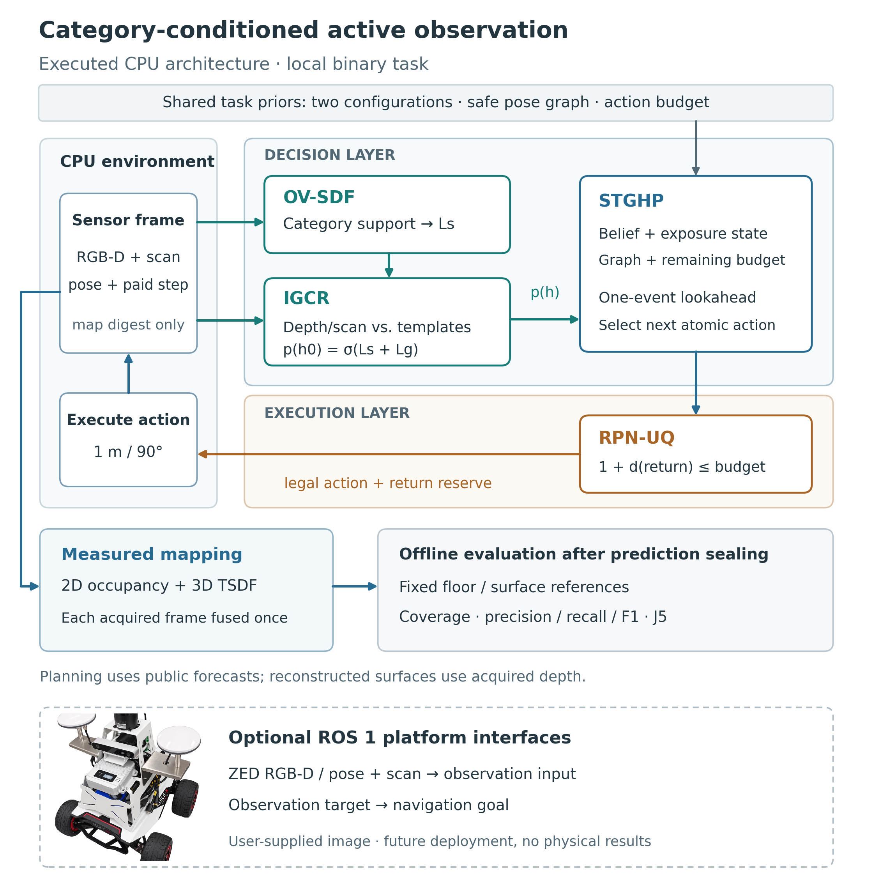

# NSO：面向工业设施的语义主动三维建图

> **当前成果与换设备入口（2026-09-29）：** [最新 main（22 页）](docs/thesis/submission_20260929_revised/main.pdf) · [主文源稿与材料包](docs/thesis/CURRENT_MAIN.md) · [换设备交接](docs/research/DEVICE_MIGRATION_HANDOFF_20260929.md)。最新实验、论文和代码继续在本 NSO 仓库维护。

> **仓库用途更新（2026-09-28）：** 清理后的独立项目已完整复制至 [SGAM 仓库](https://github.com/Jimmy7338/Semantic-Geometric-Active-Mapping)。本 NSO 仓库同时保存当前实现与恢复后的历史源码、依赖和实验资料，用于追溯与复现。恢复范围、旧环境缺件及两个仓库的区别见[迁移与恢复说明](docs/research/REPOSITORY_SPLIT_AND_RECOVERY_20260928.md)。

NSO研究机器人如何在有限运动预算内选择观察位置，同时兼顾二维区域覆盖与设施三维表面质量。工业设备、工位及物料布置改变后，机器人需要重新获取环境；本项目验证单次任务内环境静止的主动观察与建档，不涉及动态避障。

本轮按[固定最终目标](docs/research/FINAL_PAPER_THESIS_TARGETS_20260929.md)收尾，CPU虚拟实验为主要证据，保留 OV-SDF、STGHP、RPN-UQ、IGCR 四接口和规划—执行层次。最后八次新布局验证已完成，不再自动扩增实验。[最终交付入口](docs/research/FINAL_DELIVERY_20260929.md)集中提供期刊格式包、毕业论文、答辩与复现材料。正式投稿与学校评阅是后续外部流程。

## 论文与展示

| 材料 | 内容 |
|---|---|
| [毕业论文全文](docs/thesis/GRADUATION_THESIS_20260928.pdf) · [可编辑章节索引](docs/thesis/GRADUATION_DELIVERY_GUIDE_20260928.md) | 五章正文、中英文摘要、实验分析与复现附录 |
| [JIRS格式主文](docs/thesis/submission_20260929_revised/main.pdf) · [完整投稿材料ZIP](docs/thesis/submission_20260929_revised.zip) | 修订版22页、8图5表，补完整方法与算法；作者信息和声明待签署，尚未投稿 |
| [答辩PPT](docs/thesis/defense_20260929/semantic_geometric_mapping_defense.pptx) · [PDF](docs/thesis/defense_20260929/semantic_geometric_mapping_defense.pdf) | 19页、讲稿与18项问答 |
| [离线交互回放](docs/thesis/demos/v40_replay/index.html) · [复现索引](docs/research/FINAL_METHOD_REPRODUCTION_INDEX_20260929.md) | 实际保存轨迹与重建；无需GPU |
| [完整英文证据稿](docs/thesis/VIRTUAL_PAPER_EN_20260928.pdf) | 36页、22图9表；包含全部扩展、消融与新布局 |
| [系统架构图](docs/thesis/figures/final_architecture_20260929/final_architecture.pdf) | 小车平台、四模块、实测重建与离线评价 |
| [场景与三维重建展示](docs/thesis/figures/scene_details_20260928/) | 场景、实际路线、同视角网格与局部细节 |
| [重建过程与实际路径](docs/research/ARTICLE_RECONSTRUCTION_CHECKPOINTS_20260928.md) | 40个真实重融合检查点、完整动作成本及同视角网格 |
| [最后布局验证](docs/research/FINAL_VALIDATION_INDEPENDENT_REVIEW_20260929.md) | 2个新背景布局、8次任务；1胜3平、均值+2.9818%，全部报告 |
| [当前进度](docs/research/CURRENT_RESEARCH_STATE.json) · [接续计划](docs/research/GOAL_PROMPT.md) | 最新结果、证据边界与文章优先接续事项 |



架构图使用未经生成式修改的用户小车图与程序绘制的矢量框图；实际实验结果来自保存的观测、路线与网格。照片说明可用平台，不代表实车性能实验。

## 四模块与实现

| 模块 | 当前CPU实现 |
|---|---|
| OV-SDF | 登记观测与类别证据，形成类别条件的构型先验 |
| IGCR | 比较实测深度/扫描与公开模板的残差，更新构型信念 |
| STGHP | 根据共同安全图、模板预测和预算选择下一观察姿态 |
| RPN-UQ | 检查动作合法性与返航预算，交给执行接口 |

语义与几何证据共同支持规划。二维地图与CPU TSDF独立融合实际观测；模板预测不补入实测网格，参考真值只用于任务结束后的评价。当前控制器输出对应一个原子动作。

## 已保存的实验

- **主确认：** 两布局、每布局两构型，四组G/S配对为两胜两平，平均联合指标相对提高6.1638%，收益来自表面F1改善，平均覆盖相同。
- **冻结策略新布局：** 8/8合格，四配对一胜三平，平均联合指标+2.9818%；相同设施族与公开模板，只改变预登记背景通行结构。
- **错误先验与纠错：** 整体纠错政策的开发批联合指标提高2.6241%；严格2 cm阈值下保留负例。
- **独立扩展：** 128项全部保留，96项合格完成，32项为低预算规划不可行。42步原布局与同族变体的平均类别收益为6.2505%和4.2289%；54步原布局为−0.6995%。见[完整结果](docs/research/THESIS_EXPANSION_RESULT_20260928.md)。
- **其他机制：** [SWAP-I/VISTA-I共同CPU比较](docs/research/V39_EXTERNAL_CPU_RESULTS_20260920.md)与[TARE核心迁移](docs/research/V39_TARE_TRANSFER_RESULT_20260920.md)分别说明机制和工程接口，非原作者完整系统的统一排名。
- **三布局场景扩展：** 3版本×12条共36次尝试；35次原流程合格，1次原评价失败保留派生补测。9组共享S/B均持平，48条保留主矩阵未执行。
- **较早开发：** [六父场景开发与消融](docs/research/SEMANTIC_DEVELOPMENT_RESULT_BRIEF_20260923.md)未达到其预定收益门，保留原始记录，与论文主确认分开报告。

这些结果支持公开设施模板、共同导航图、受控类别输入及准确位姿条件下的机制价值；噪声重复和同族变体不视为新增独立父布局。

## 代码入口

| 目录或文件 | 用途 |
|---|---|
| `nso/` | 自研语义、结构信念、有限预算规划和四模块控制器 |
| `env/` | 自研二维与三维虚拟环境、传感及设备场景 |
| `utils/` | 几何、观测协议、重建评价与实验工具 |
| `semantic/class_mapping.py` | 当前语义前端使用的类别映射 |
| `configs/` | CPU实验矩阵、场景和传感配置 |
| `scripts/` | 实验执行、独立评价、图表和论文构建 |
| `tests/` | 协议、规划、语义、几何和评价测试 |
| `audit_results/`、`eval_results/` | 保存的观测、地图、结果、失败记录和历史清单 |
| `docs/` | 论文、研究记录、图表及复现说明 |

主控制器为[`nso/cpu_four_modules_v35.py`](nso/cpu_four_modules_v35.py)，规划器为[`nso/online_planner_v35.py`](nso/online_planner_v35.py)，观测信念为[`nso/observation_belief_v35.py`](nso/observation_belief_v35.py)。后续层次接口与语义开发仍保留在`nso/`及对应实验脚本中。

## CPU使用

Python科学依赖按用途安装，GPU不是当前虚拟控制器和TSDF重建的条件：

```bash
python3 -m venv .venv-local
.venv-local/bin/python -m pip install -r requirements-cpu.txt
# 需要三维TSDF时安装：
.venv-local/bin/python -m pip install -r requirements-3d.txt
```

快速检查四模块及二维环境：

```bash
python3 -B -m unittest discover -s tests/virtual3d -p 'test_cpu_four_modules_v35.py'
python3 -B -m unittest discover -s tests/cpu -p 'test_grid_exploration.py'
python3 -B scripts/eval_cpu.py --config configs/cpu/pilot.json --output tmp/cpu-check
```

请在已安装相应依赖的解释器中执行。可选神经组件测试另需CPU PyTorch。历史版本、线程设置和数据入口见[平台复现说明](docs/thesis/PLATFORM_REPRODUCTION_20260928.md)。已有实验批次禁止覆盖；新实验需独立输出并重新记录源码和配置。

## 仓库发布与复现范围

2026-09-28清理后的独立快照已复制到SGAM仓库。原NSO随后恢复历史源码、源码归档、旧环境与数据，保留原始来源许可；传感数据、路线、网格、评价和原始校验记录未改写。旧批次的源码校验重新通过，但旧神经训练所需的部分LFS本体、子模块和外部场景仍需另行获取，不能据此声称旧训练环境已全部配置完成。

清理范围、逐文件摘要及本地恢复方法见[发布迁移说明](docs/research/STANDALONE_RELEASE_20260928.md)。研究文献引用、第三方方法名称和外部依赖来源仍按实际使用保留。本项目使用[MIT许可](LICENSE)，外部软件与资源遵循各自许可。
