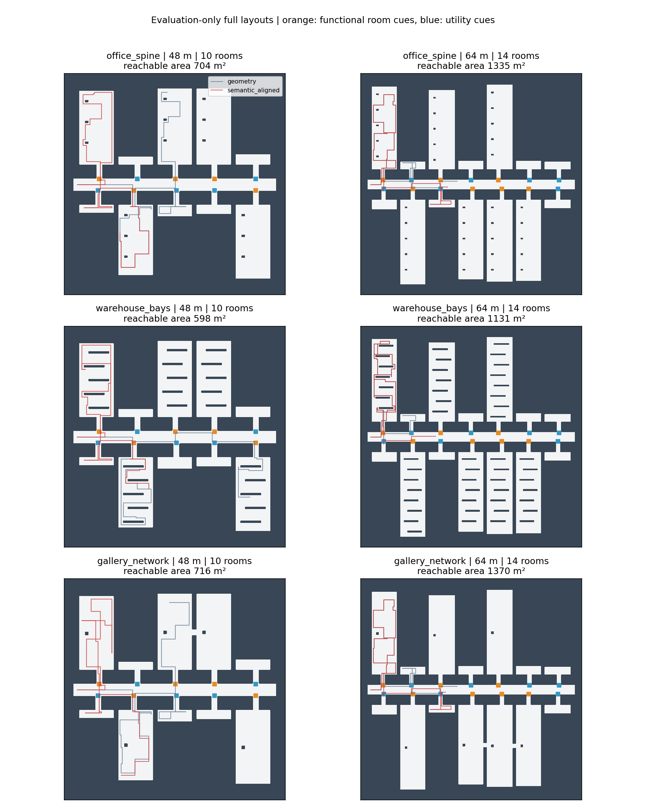

# 面向大规模功能语义场景的适配实验

日期：2026-09-10。本研究响应“项目的优势可能需要特定大尺度、具有语义特点的环境才能体现”的假设。它是新增的场景适配实验，与先前通用几何套件并列；不是替换或撤销已有负结果。

## 从项目目标到可检验假设

项目文档描述的目标是大尺度未知室内环境的主动面积覆盖，重点涉及长走廊、多房间、门洞、功能语义和重复回溯。旧二维套件主要包含少量房间和随机显著性热点，热点与房间功能、后续可探索空间没有联系。这适合检查接口和基础行为，但对“功能线索能帮助选择探索分支”的假设缺乏针对性。

本实验提出三个条件化假设：

1. 当局部可见语义类别能预测某个分支通往大面积工作/公共空间，语义引导有机会在相同动作预算下提高物理覆盖效率。
2. 多房间、长连接通道和跨房间连通关系增加规划难度，可能使区域结构评分有用；需要用“语义加结构”对比“仅语义”单独检验，不能把语义收益归功于结构模块。
3. 若收益来自线索携带的信息，同图上打乱功能线索后应出现收益变化；统一强度的入口标记用于区分“发现入口”与“识别入口功能”的作用，误标条件检验对信息质量的依赖。

假设并不预设实验一定有提升。该 CPU 平台是当前可运行的规划机制实现，并未复现全部旧三维 NSO 神经系统；换场景也不能替代真实 RGB-D、开放词汇检测、SLAM 或 PPO 的证据。

## 三类场景

| 场景 | 几何设计 | 可见功能线索的含义 | 主要检验 |
|---|---|---|---|
| office_spine | 长主走廊、两侧办公室与辅助用房、局部桌状障碍 | 工作区入口与辅助间入口的类别不同 | 分支选择能否减少低面积支路消耗 |
| warehouse_bays | 分区通道、带遮挡货架的大储存区、小服务间 | 储存通道与服务间标记不同 | 大空间遮挡和绕行条件下的覆盖收益 |
| gallery_network | 公共展厅、后勤支路、相邻公共房间之间的连接 | 公共展厅与后勤入口标记不同 | 功能语义与房间连接关系的增量作用 |

这些是程序生成的抽象功能建筑，不是采集到的真实办公室、仓库或博物馆。入口类别先分配，空间大小按功能条件生成；高、低显著性固定为 0.9、0.1，不直接等于隐藏房间面积。功能类别与空间大小的强关联是实验主动提供的先验，理想线索条件可视为该假设下的受控验证，不能声称已经从真实图像识别出这样的先验。

两种尺度为 192×192、256×256 栅格，分辨率 0.25 m，对应外接边长 48 m、64 m。每图分别有 10、14 个房间。房间入口保留相同宽度的门洞和 12 格入口通道，门口提供小块类别线索；策略必须经过传感器实际观察后才能使用它。场景描述文件记录精确可通行面积、房间数量和跨房间连接数量，不只以地图名称判断规模。

每张图固定一半为工作/公共/储存功能房间，另一半为辅助房间，位置由种子随机排列。两种入口位置位于主通道两端，种子 51 从一端进入、52 从另一端进入，避免只选择有利的一侧；每张图只有一个配对起点，仍需要后续更多重复验证。

## 语义干预与公平比较

所有方法使用相同物理地图、起点、朝向、传感器和动作预算；只改变策略开关或可见的语义类别线索：

- `geometry`：既有几何预算对照，完全忽略语义。
- `semantic_aligned`：仅语义，入口线索与功能类别一致。
- `semantic_shuffled`：仅语义，将同图入口线索强度随机置换；标记位置、数量和数值直方图相同。
- `semantic_constant`：仅语义，所有入口标记强度统一为 0.5，保留入口显著性但无类别区分。
- `semantic_noisy`：仅语义，每个入口独立以 20% 概率把高/低类别交换；小样本的实际错误比例单独记录。
- `combined_aligned`：既有语义与结构组合，使用一致线索。
- `combined_shuffled`：同一组合规划器，使用置换线索。

未知区域的语义观测为 NaN；策略仅保存已观测值。房间功能表、完整语义场、房间面积、地标表和完整占据图均仅供生成器或评估器使用。策略没有访问这些数据的接口。随机置换可能保留一部分正确关联，因此逐图记录置换后大功能房间仍被标为高值的比例。

此轮保持原 CPU 规划器、候选数 24、语义/结构权重 1、32 步目标预算、10 步拓扑更新周期不变，专门检验场景适配。机器人半径为 0.2 m，传感距离为 3 m、视野 90°，每回合 600 个原子动作，转向计步。配置调整适用于全部条件。未重新训练网络，也未把这组无 RPN 的机制对照标成原完整神经 NSO。

## 实验矩阵与统计边界

一次性固定三类场景 × 两种尺度 × 两个种子（51、52），共 12 张地图，每图七个条件，共 84 回合。运行前检查旋转/镜像等价几何不重复，保存配置、源码哈希和源码副本，运行后再次校验。开发连通性和传感器检查使用不同种子；80 步小试仅检验流程，不用于调权重或挑选正式场景。84 回合全部保留。

主要任务仍为物理面积覆盖，报告完整动作预算的覆盖 AUC 和最终覆盖率。功能区域覆盖率、功能地标观察数量、重复移动及碰撞为次要指标，不能用来掩盖面积覆盖的下降。功能区域面积取起点可达区域与功能房间标签的交集，评估器单独计算。

对比同时报告每类场景、每种尺度及全部地图的结果，避免挑选获胜场景。配对差异的地图重采样区间仅作探索性描述；三类场景和两种尺度共享两个种子带来的布局变量，不具有 12 个完全独立真实建筑的多样性。因此还报告各个种子块的平均 AUC 差异，不以多次探索性比较宣称广泛显著性或真实场景泛化。

## 运行与归档

```bash
.venv-cpu/bin/python scripts/eval_targeted_scenes.py --config configs/cpu/targeted_scenes_v1.json --output eval_results/my_targeted_scenes_v1
.venv-cpu/bin/python scripts/analyze_targeted_scenes.py eval_results/my_targeted_scenes_v1
.venv-cpu/bin/python scripts/analyze_targeted_scale.py eval_results/my_targeted_scenes_v1
.venv-cpu/bin/python -m unittest discover -s tests/cpu -p 'test_targeted*.py' -v
```

运行目录必须不存在。生成器：`env/targeted_scenes.py`；每张图的 `.scene.json`/`.scene.npz` 保存物理参数、功能类别、完整图和各语义干预；每回合保存逐步指标、观测掩码、轨迹、候选评分与目标结果。分析器独立重建面积覆盖和 AUC，并验证配对起点及语义可见范围。

已有 `formal_v1` 的配置、规划器源码和模型哈希保持不变，可继续复现。新场景实验单独归档到 `eval_results/cpu_targeted_scenes_v1_20260910/`。

## 实测结果



84 回合全部完成，无碰撞，逐步覆盖率与 AUC 重建全部通过。

| 尺度 | 几何 AUC | 仅语义 AUC | 语义＋结构 AUC | 组合相对几何变化 | 几何最终覆盖 | 组合最终覆盖 |
|---|---:|---:|---:|---:|---:|---:|
| 48 m | 0.2036 | 0.1909 | 0.1523 | -25.20% | 38.44% | 27.82% |
| 64 m | 0.0953 | 0.0975 | 0.1004 | +5.33% | 17.82% | 16.63% |

64 米组中，三类建筑各自的平均组合 AUC 均高于几何对照，整体相对提高 5.33%。但仅有六张图且共享两个种子；AUC 绝对差值为 +0.0051，探索性区间为 [−0.0065, +0.0192]，仍包含 0。这是值得继续验证的尺度相关信号，不是已经确立的普遍优势。

64 米组第 400 步的组合平均覆盖为 14.52%，几何对照为 11.89%；到 600 步时组合为 16.63%，几何为 17.82%。因此本次正向 AUC 信号主要反映探索过程中期的收益，没有保持为预算结束时更高的覆盖。48 米组组合 AUC 下降 25.20%，该结果同时保留。

在全部 12 张图上，仅语义的一致线索相对置换线索的 AUC 差值为 +0.0043，8 张提高、4 张下降；相对统一入口强度的差值为 +0.0171，说明类别信息与单纯入口显著性存在区别。但仅语义相对几何对照的全体差值仍为 −0.0052，组合为 −0.0231，所以“之前不好完全是因为场景不合适”尚未得到支持。

总体最终覆盖：几何 28.13%，仅语义 26.56%，组合 22.22%。功能区域的次要覆盖率分别为 25.06%、25.81%、15.22%，不能用这一项仅语义的小幅变化替代主要面积指标。完整七条件及逐类逐尺度数值见 `summary.json`，两尺度汇总见 `scale_analysis.json`。

## 对项目路线的影响

本次设计使语义线索有了可解释的空间含义，并在更大场景中观察到组合过程覆盖效率的正向信号。后续应将“大场景、分支间探索价值差异、局部可见功能线索”作为明确的适用假设，扩大随机种子和起点来检验其稳定性。场景不再只使用随机热点。

同时需要检查现有 CPU 组合规划器为什么在 48 米组退化、为何在 64 米组的中期收益不能维持到终点，尤其是目标预算、路径失效后的重规划及区域目标评分。场景改进与算法改进应分别版本化，不能修改这 84 回合后继续把同一批结果当作未调参测试。当前证据仍不支持把该 CPU 组合等同于原三维完整 NSO 的性能。

## 验收材料

新增五项场景测试，连同已有 46 项检查共 51 项通过。检查覆盖两种尺度的连通性与面积、门口类别定义、置换前后语义支持范围和直方图一致、隐藏语义不会改变同观测决策、几何策略忽略语义，以及输出指标和起点配对。旧冻结 v1 源码与模型校验仍通过；新场景与既有归档不存在旋转/镜像等价几何重叠。

本批实际可通行面积为 597.625–1383.375 m²；84 回合循环总耗时约 238.7 秒，峰值 RSS 142.4 MiB（不含后续分析阶段的峰值）。无需显卡和新依赖。验证记录见 `audit_results/2026-09-10/targeted_study_verification.json`。
