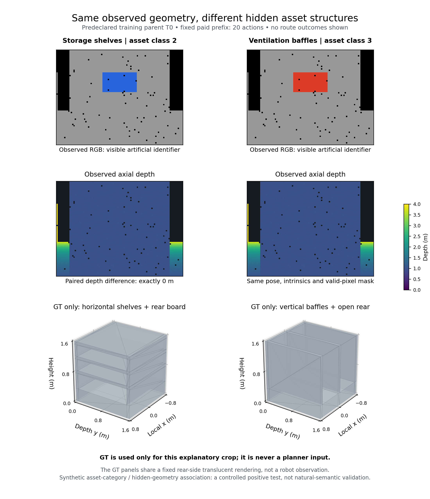

# V7：保持四模块的类别条件观测响应原型

日期：2026-09-11。本文说明实现与实验边界，阶段结果以配套记录为准。用户确认保留 ANS 双层结构及 OV-SDF、STGHP、RPN-UQ、IGCR 四模块接口，允许修改内部算法。语义仍是必须独立验证的创新内容。

## 1. 本次修正针对什么问题

旧实验没有建立完整方案优势。V6 的独立原始传感器复算覆盖6个历史、88条候选：描述量和六通道特征最大误差均为 $1.11\times10^{-16}$。但是历史方位位图使用各表面点为原点，候选方位使用簇中心；视野内点—位姿对有23,339/86,649（26.94%）的方位扇区不一致。该比例不能直接换算成收益误差。

V7统一使用各实测点计算方位新颖性。片段朝向来自实测法向，并用真实保留图像中深度一致支持最多的相机定向；没有深度支持时，禁用前／侧／后方向特征和对应方向候选。共同候选保留对象身份并分配多个观测方位。零支持处理、重复路线处理和多对象分配在第一条V7未来分支执行前修正并封存。

另一个问题是类别必须解释**不同动作的收益差异**。V7不再沿用V3未校准的形状概率，也不把推测出的补全表面直接当作收益。它从有界训练集学习类别与实测方向描述的交互，并预测真实执行产生的面积率与F1变化。旧V3评分仍封存为对照。

证据：[V6原始复算](../../eval_results/semantic_view_response_v6_raw_review_20260911/RAW_GEOMETRY_REVIEW.md)。

## 2. 配对世界与因果含义

每个父上下文包含两种设备：储物层架和通风挡板。它们共享正面遮挡板、低矮底座、地面占据、观测起点、20步动作和噪声序列；遮挡后的内部结构不同。可见图像标记提供设备类别，代码2、3分别表示这两种真实结构家族。它们不再表示旧场景中的“简单／复杂”。

两世界在前21帧的深度、雷达、位姿、标记位置掩码、非标记RGB以及非语义地图上逐项相同；标记颜色允许不同。未来观测不保证相同，因为遮挡后的物理结构确实不同。类标解释交换和缺失实验在同一物理观测上重建输入，不能改变RGB-D本身。

8个训练父上下文T0—T7与4个校准父上下文C0—C3在运行前固定。每对的两种设备、全部路线和噪声属于同一数据角色，不能将路线视为独立场景。候选只根据共同观测生成，每世界6条，全部去返动作不超过48。固定结构检查要求每个历史至少支持两个标记片段方向；不满足时停止并保留失败，不能看收益后换场景。

这是人工植入类别—隐藏结构关联的合成正控制。它能检验条件信息是否被正确利用；即使有正结果，也不能单独证明自然开放词汇泛化、大规模场景优势或实车收益。

在完全相同候选池下，设两种家族的实际面积率为 $u_1(a),u_2(a)$。可事后计算理想类别信息的决策上界：

$$
V_{oracle}=\frac{\max_a u_1(a)+\max_a u_2(a)}{2}
-\max_a\frac{u_1(a)+u_2(a)}{2}\ge0.
$$

有限候选下，若两家族有共同最优动作，则此差为零；若最优动作集合不相交，则严格为正。该量使用未来真值，只是场景与动作池的可辨别性诊断，不能输入规划器、替代实际S成绩或据此删除不利上下文。它区分“类别相关结构却没有决策价值”与“有价值但模型未学到”。

冻结合同：[上下文](../../configs/virtual3d/response_v7_contexts.json)、[采集和拟合](../../configs/virtual3d/response_v7_pipeline.json)、[首次校准前固定的域外守卫](../../configs/virtual3d/response_v7_validation.json)。

## 3. 方向相关响应与有限拟合

令已观测片段 $o$ 的点集为 $P_o$，估计方向为 $n_o$。对相机位姿 $v$ 和实测点 $p$，以视野指示 $I(p,v)$、量程 $R$ 和三维距离 $d(p,v)$ 定义

$$
w(p,v)=\frac{I(p,v)}{1+(d(p,v)/R)^2}.
$$

四维描述由前向正余弦、侧向正弦、后向正余弦和未观察过的八分方位位构成，乘以上式权重。方位位以同一个点 $p$ 为原点。没有深度支持时前三维为零。对一条路线 $a$，每点各维取沿途最大值，再对点求平均：

$$
\phi_{o,k}(a)=\frac{\widehat A_o}{R^2 L_a}
\frac{1}{|P_o|}\sum_{p\in P_o}\max_{v\in a}d_k(p,v),
\qquad \widehat A_o=N_o(0.15\mathrm{m})^2.
$$

$N_o$ 是持久化证据键数量，128点采样用于方向描述，支撑数量沿用全部被接受点。$\widehat A_o$ 是支撑代理，**不是唯一真实表面积**；视野指示也不是遮挡可见性证明。沿路线取最大值避免重复状态累加，但不使代理等于实际重建精度。

共同四列包含雷达未知区域、相机未看区域、旧面质量代理和逆动作成本。对象四列为上述方向描述；O与S使用完全相同对象性权重。类别四列为对象描述乘以可见类别投票 $z_o\in[-1,1]$。G、O、S、N以及增加固定几何平方项的G_capacity分别重训，S不拥有更好的候选或几何输入。交换类标X使用冻结S权重，缺失M在实际重融检查后恢复G。

训练损失采用每历史等权的中心化误差：

$$
\sum_{h\in T}\frac{1}{n_h}\|\widetilde Y_h-\widetilde X_h\beta\|_F^2
+\alpha\|\beta\|_F^2,\qquad \alpha\in\{0.1,1,10\}.
$$

只在T内部按父上下文留一交叉验证，以第一列真实面积率为选择目标，并列选较强正则。F1增量是单独的响应列。特征按固定物理尺度归一化，不使用训练标准差放大小变化。选择完正则后检查有效自由度不超过4，失败不自动换另一个正则。还检查类别／方位支撑和类别交互对几何的非零投影残差。

中心化预测保留符号，不加入测试真值均值，不再次除路线成本。绝对面积单独使用 $\widehat A=L\max(0,a r_{rel}+b)$，只在C拟合两个公共参数，不能反馈排名。预测中的 $L$ 是执行前已知的计划成本；实际面积率使用真实付费成本，执行失败的两者差异保留。

T拟合的G前八列最小／最大范围外扩25%，最小数值容差为 $10^{-6}$；任何候选超范围时整段历史回退至冻结N。原始与回退结果分表，样本不排除。这是保守范围检查，不是概率保证，不能把回退后与N相同的结果称为语义增益。

## 4. 四模块内部接入方式

|保留模块|内部改造职责|本轮证据边界|
|---|---|---|
|OV-SDF|维护实测片段、方向证据和类别条件响应状态；二维场作为汇总，详细片段通过附属状态传递|CPU片段特征已实现，尚未完成真实开放词汇投影与原模块全接线|
|STGHP|保持区域与全局目标接口，由共同安全图生成多对象、多方向候选，保留覆盖任务预算|本轮是固定历史局部去返候选，不能替代全局拓扑闭环验证|
|RPN-UQ|先检查完整车体安全及真实动作预算，再接独立校准的执行风险|本轮验证确定性安全图；响应ridge的残差不是路径失败概率|
|IGCR|预测响应仅用于选点；真实二维覆盖、三维质量变化及付费动作分开结算|评价可以读取真值；部署反馈需要传感器可计算代理，不能直接把仿真真值标签当实车奖励|

ANS全局／局部层次继续保留。当前CPU实验用于确认内部响应机制，不是完整四模块神经系统。后续只有在机制门槛通过后，才将冻结响应模型接入长期目标评分和局部执行，并验证同一总任务预算下的覆盖、F1及联合AUC。

## 5. 执行与证据标准

每条候选先封存，随后实际逐动作执行、记录原始RGB-D与雷达、融合TSDF。新增表面积使用唯一实体外表面参考，权重在可见性筛选前由总面积/32,000固定；去程、端点、回程取并集，不按类别加权。F1@2cm/5cm允许负变化，联合指标保留覆盖与F1分解。

独立回放器从封存源码启动隔离进程，逐动作检查传感器、覆盖、状态与成本，并重算前缀／端点／终点网格、面积并集、P/R/F1和分支联合AUC。通过回放说明实施与记录一致，不说明方法具有优势。48动作分支AUC使用稀疏检查点插值并在短路线后保持地图，只能称为分支近似，不能作为持续覆盖的系统成绩。

所有T批次按固定顺序完成执行和独立回放后才拟合。C必须先完成四对前缀和全部预测的统一封存，之后才开放任何C未来分支。未通过训练、校准和强对照门槛时不打开753/754；独立确认种子也保持未启用。

全部门槛及失败处理见[有限验证协议](SEMANTIC_V6_NEXT_VALIDATION_PROTOCOL.md)。具体阶段账本见[当前研究状态](CURRENT_RESEARCH_STATE.json)。

## 6. 本轮已完成的训练与停止结论

8个T父上下文全部执行，共16个配对历史、96条候选、2,892个分支动作和320个前缀动作。独立回放覆盖全部已执行动作、网格和指标。4条路线在模拟器中碰撞提前结束，不能将“回放通过”理解为96条均成功返程。失败集中于T1、T4的两种设备各自的候选5；实际动作16／18，原计划34／38。它们完整保留在训练与失败账本中。

全部5个模型均在T内部选择 $\alpha=0.1$；有效自由度约0.895—1.025，结构和容量检查通过。T内16个历史的9个模型／干预通道全部同选，平均面积率1.994412平方米／动作、F1@5cm增量0.332275，无选中失败路线。这个T内拟合诊断没有建立语义增益，更不是校准或未见场景成绩。

更关键的是，8对世界的类别条件oracle与共同几何边缘oracle相等，面积率决策价值上界均为零。两种设备虽有不同物理结构，在本候选池下仍有相同最优动作。T1／T4的oracle包含失败短分支，必须与成功路线敏感性检查分开理解；不能把该上界称为成功返回效能。该负结果说明仅制造结构差异仍不足以验证决策信息价值；不能据此继续提高语义权重，也不应把C用于反复试改。

碰撞复融诊断还发现：4条失败路线在撞击前，最新传感器地图均已将下一格判为不可通行，但冻结路线执行器没有在线复核。模拟器保守栅格边界与连续物理箱体也存在离散差异；两处目标中心距物理箱体约0.28m，大于0.2m圆形车体半径，但模拟器采用的膨胀栅格仍判阻塞。本轮保留模拟器原规则及碰撞记录，不修改真值来消除失败。最新地图本身已足以拦截这4个动作，无需规划器读取真值。

因此原V7在首次C之前停止扩展，C0—C3、753／754及独立确认集尚未开放。后续首先验证新的逐动作可行性门禁和失败后的安全返回；这是RPN执行入口的内部修正，不改变四模块与层次结构。再单列新版本的任务设计，检验类别是否改变预算受限下的最优选择；不得把改版结果混入本V7。

后续[对象／背景独立分解](../../eval_results/response_v7_value_diagnosis_20260911/REPORT.md)确认：前缀背景仅观察41.68%—44.92%，全分支反事实新增面积合计91.13%来自背景；该加总不是一条轨迹的累计面积。只看对象面积率，仍有7/8上下文的类别信息上界为零，非零一例仅0.000594792平方米／动作。成功共同候选的敏感性表中，全场信息上界仍8/8为零；分支联合J-AUC也8/8为零。不能仅靠背景降权或改用联合指标绕开本轮否定结论。

[V8执行修正回归](EXECUTION_GUARD_V8_FAILURE_REGRESSION_20260911.md)已让全部4条已知碰撞路线实际无碰撞返回原位置和朝向，合计128个付费动作；原候选目标均未完成。独立传感器、几何门禁、BFS返程与网格回放全部通过。然而，全96条原路线审计显示门禁还会改变6条原成功路线，影响4/16个历史、36/144个已封存选择，其中1条因当前位置footprint不安全而无已知安全返回。不能只修补4条失败后沿用旧语义收益标签。

证据：[完整T采集账本](../../eval_results/response_v7_training_20260911/ACQUISITION_REPORT.md)、[冻结拟合](../../eval_results/response_v7_T_fit_20260911/fit_summary.json)、[配对oracle](../../eval_results/response_v7_T_fit_20260911/paired_information_oracle.json)、[碰撞诊断](../../eval_results/response_v7_collision_diagnosis_20260911/summary.json)。T0的[独立特征数学复算](../../eval_results/response_v7_feature_math_review_T0_20260911/FEATURE_MATH_REVIEW.md)核对12候选、7通道共1,008个标量，最大误差 $2.65\times10^{-23}$，不读取未来观测或收益。

存储按事先规则归档6个无执行失败上下文的120个中间网格，保留全部原始传感器记录、参考、前缀和候选0网格；T1、T4保留所有网格。释放243,758,933字节（约232.47MiB）。T0的20个归档网格从原始观测重新融合后，逐数组和完整文件SHA均精确匹配。[存储审查](RESPONSE_V7_MESH_COMPACTION_REVIEW_20260911.md)不替代算法效能验证。

