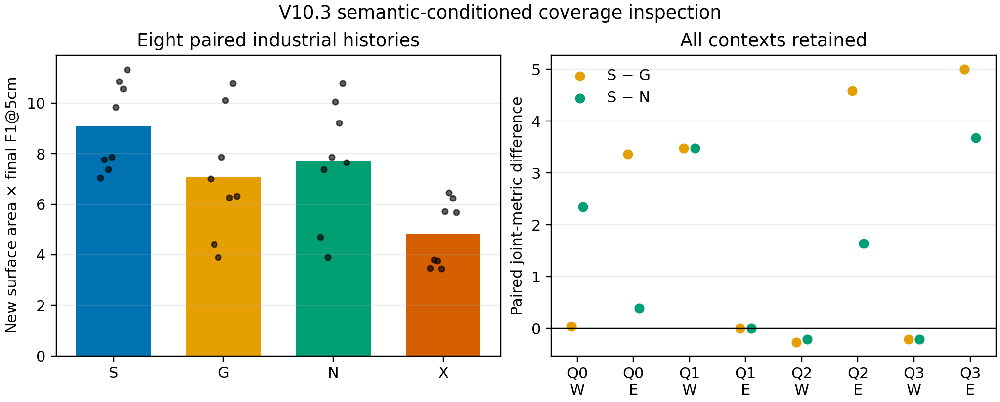

# V10.3：覆盖约束下语义条件三维巡检的结果、理论与论文边界

## 可直接用于论文的结论

本项目保留 ANS 的全局目标—局部动作层次，以及 OV-SDF、STGHP、RPN-UQ、IGCR 四个接口。V10.3 将研究任务限定为：移动机器人先完成一条所有方法共享的设施基础覆盖路线，再利用固定的 48 个动作预算，对初见轮廓相近、隐藏结构不同的工业资产进行语义条件补充观察。CPU 后端使用真实渲染 RGB-D、单线雷达、TSDF 融合和逐动作返航检查。

在四组资产尺寸/深度噪声条件和左右互换的八个物理历史上，完整语义模式 S 的“新增唯一表面积 × 最终 F1@5cm”均值为 **9.079661**。同候选、同预算、同重建后端下，S 相对几何完成模式 G 提高 **28.27%**，相对无类别模式 N 提高 **18.07%**，相对错误类别关联 X 提高 **88.34%**。S 对 G 为 6 胜 2 负，对 N 为 6 胜 2 负，对 X 为 8 胜 0 负。40 个 V10.3 分支全部执行 48 个后续动作，零碰撞并返回同一位置与朝向。

该结果证明的是**有限人工工业资产域内，正确类别—隐藏结构关联对覆盖式三维巡检有可验证的条件价值**。它不是自然开放词汇识别结果，不是独立场景泛化结果，也不是已经运行 TARE/FUEL/FALCON 原作者系统后的主流基线结论。G 与 N 是在本系统中严格对齐候选、运动、安全和重建后端的强内部基线。

## 版本演化与失败证据

| 版本 | 修改 | 结果 | 结论 |
|---|---|---|---|
| V10 | 四接口首次进入真实传感器闭环 | 32/32 动作为原地旋转 | 候选先按短期收益率截断，导致移动候选在总评分前消失 |
| V10.1 | 保留四个不同目标格；按承诺去程总收益评分；逐动作 Beta 实现率 | S 相对 G +17.67%，相对 N +16.92%；24/24 安全 | 修复移动失效，并建立完整闭环语义均值收益 |
| V10.2 | 不再把预测但未实现的相机视野永久拉黑 | S 相对 G +18.31%，相对 N +15.85% | 修正双重消费，但关闭反馈仍高 1.44% |
| V10.3 | 用真实表面八方向观测位替代“相机位姿等于已观察”的推断 | S 相对 G +28.27%，相对 N +18.07%，相对 X +88.34% | 预测不再冒充观测；语义域优势增强 |

V10.2 的通道隔离显示，“只保留历史语义视角反馈”逐场景等于完整反馈，“只保留实现率后验”逐场景等于关闭反馈，因此负作用来自位姿推断的资产观察消费，而不是 Beta 实现率。V10.3 中，完整反馈与关闭反馈 8/8 轨迹和指标相同。故当前 IGCR 已从负作用修正为**性能中性**；它提供真实观测结算、预算、失败与安全闭环证据，但不能写成独立性能增益。所有这些失败和中性结果必须与正结果一起保留。

## 统一目标

设基础覆盖前缀结束于时刻 (t_0)，最终时刻为 (T)。评价器使用固定、与策略隔离的表面样本集合 (℘)，每个样本面积权重为 (a_j)。前缀已可见集合为 (V_{t_0})，后续真实传感器可见集合为 (V_{t_0:T})。新增唯一表面积为

\[
A_{\mathrm{new}}=\sum_{j\in\mathcal P}a_j
\mathbf 1[j\notin V_{t_0}]\mathbf 1[j\in V_{t_0:T}].
\]

对最终 TSDF 网格 (M_T)，在距离阈值 (δ=5\,\mathrm{cm}) 下定义面积采样精确率 (P_δ)、完整率 (R_δ) 和

\[
F_{1,δ}(M_T)=\frac{2P_δR_δ}{P_δ+R_δ},
\qquad
J_T=A_{\mathrm{new}}F_{1,δ}(M_T).
\]

乘积要求新增观察既覆盖更多真实表面，又被最终重建正确表达。它不会因为类别本身得到额外权重。该乘积一般不满足次模性，也不保证每次 TSDF 融合后单调，因此只作为外部评价指标，不直接冒充在线信息增益。

## V10.3 的在线代理

对一条可执行往返选项 (r)，仅把承诺的去程状态 (r^+) 计入收益；返程只进入可行性约束。在线分数写为

\[
\widehat U_m(r)=
\hat\rho_R |\widehat{\mathcal U}_R(r^+)|Δ^2+
\hat\rho_C |\widehat{\mathcal U}_C(r^+)|Δ^2+
\widehat Q(r^+)+
\sum_o f_{o,t}(r^+)A_o^{(m)},
\]

其中 (Δ) 为地图分辨率，(ˆρ_R,ˆρ_C) 是只由已执行动作更新的雷达/相机实现率，(ˆQ) 是已测表面质量代理。N 令最后一项为零；G 使用不含类别的几何完成面积；S 使用可见类别票决后的结构先验；X 使用反转类别关联。

对资产 (o) 的实际表面观测方向位，令 (s_{o,k,t}\in[0,1]) 为第 (k\in\{0,…,7\}) 个方位上已测表面点的覆盖比例。候选路径从方向 (k(v,o)) 观察资产时，V10.3 使用

\[
f_{o,t}(r)=\max_{v\in r^+}
q_{\mathrm{ap}}(o,v)
\left[\varepsilon+(1-\varepsilon)(1-s_{o,k(v,o),t})\right],
\quad \varepsilon=0.25.
\]

(q_{\mathrm{ap}}) 是由已测尺寸、相机视锥和距离构成的有界支持；(ε) 表示“已测表面不能证明隐藏后表面不存在”的剩余完成价值。V10.1/V10.2 直接用相机位姿产生的理论视锥扣除旧收益，可能把遮挡和无效深度误当作已经观察；V10.3 只从 TSDF 表面点的真实方向位更新 (s)。

对每个动作 (a_t)，RPN-UQ 的 CPU 实现要求最新已测地图上的完整机器人足迹安全，并存在预算内返回固定锚点的动作序列：

\[
1+C_{\mathrm{return}}(x_{t+1},h_{t+1})\le b_t.
\]

这给出当前已知静态地图与离散运动模型下的返航可执行性，不是未知空间的概率安全保证。40 个分支的零碰撞和返航成功是该有限场景上的实证结果。

## 语义为何可能严格有用

固定几何历史 (G)、候选集合 (ℓ) 和隐藏结构 (H)。语义观测 (Z) 无额外采集成本，且策略可忽略它时，决策信息价值满足

\[
\mathbb E_Z\left[\max_{r\in\mathcal A}\mathbb E[u(r,H)\mid G,Z]\right]
\ge
\max_{r\in\mathcal A}\mathbb E[u(r,H)\mid G].
\]

严格大于需要 (Z) 以正概率改变最优动作，并且条件模型与真实隐藏结构相关。两种轮廓相同资产、高低隐藏面积分别为 (A_H,A_L)，预算只允许检查一个，语义判断正确率为 (p)，额外运动/推理代价为 (c) 时，理想化增益为

\[
\Delta V=(p-	frac12)(A_H-A_L)-c.
\]

本实验通过左右交换资产、S/G/N/X 共用候选与重建后端，把“类别是否正确指向高隐藏表面积”作为主要因果变量。X 在 8/8 场景受损支持这一解释；两类先验一旦在真实设施中不成立，优势可以消失甚至反转。

## 与近期工作的关系

- Zhu、Sellán 与 Terenin 的 2026 Bayesian NBV 从随机隐式曲面后验和下游任务损失推导视点效用，支持“任务相关收益优于统一降不确定性”的方向；其方法需要随机重建与 GPU 依赖，不能为本项目的手工先验提供概率校准。[论文](https://arxiv.org/abs/2605.05095)
- Vegesna 与 Zakhor 的 2026 SAGE 在 FALCON 覆盖框架上以有界语义调制重排前沿，报告对象发现收益，同时明确 FALCON 在时间、路长和体积探索上更强。这支持本项目限定应用优势，而不宣称全指标普遍领先。[论文](https://arxiv.org/abs/2605.23160)
- Sportich 等人的质量引导表面探索直接用 TSDF 不确定性和用户质量要求选择视点，说明覆盖、质量与路径效率应分项报告；它不能证明类别语义本身有用。[论文](https://arxiv.org/abs/2511.20353)
- Tao 等人的 3D Active Metric-Semantic SLAM 同时考虑探索与位姿不确定性，并面向受算力约束的平台，支持保持稀疏层次状态和闭环安全；其语义环闭合收益属于定位，不等于本项目的隐藏表面巡检收益。[论文](https://arxiv.org/abs/2309.06950)
- Zheng 等人的 Active Scene Understanding 把几何重建和语义标注熵共同写入视点评分，并沿路径积分观察价值，构成较早的语义—几何联合视角规划前作。[论文](https://arxiv.org/abs/1906.07409)
- Pred-NBV 将形状完成、信息收益和控制成本结合用于物体重建，是 G 类几何完成基线的重要依据；它使用训练形状先验和不同平台，不能直接与本 CPU 规则分数横向比较。[论文](https://arxiv.org/abs/2304.11465)

这些工作共同支持“任务条件、质量感知、语义重排和闭环成本”四个设计原则，也表明单纯把语义加入前沿或让物体多看几次不构成充分创新。NSO 当前最可辩护的新意是：在保留覆盖层次与返航约束的情况下，用类别条件隐藏结构需求重排完整位姿选项，并用真实表面方向证据限制预测消费。

## 证据位置与复现边界

- V10.1 完整原始传感器运行：`eval_results/cpu_semantic_inspection_v10_1_development_20260911/`
- V10.1 独立物理/地图/网格/指标重放：`eval_results/cpu_semantic_inspection_v10_1_replay_20260911/`
- V10.2 反馈通道隔离：`eval_results/cpu_feedback_channel_ablation_v10_2_20260911/`
- V10.3 40 分支结果：`eval_results/cpu_semantic_inspection_v10_3_development_20260911/`
- V10.3 独立物理与指标重放：`eval_results/cpu_semantic_inspection_v10_3_replay_20260911/`
- V10.3 冻结协议：`configs/virtual3d/cpu_four_module_v10_3_development_protocol.json`

V10.1 的独立程序重放了 24/24 分支，并核对冻结源码、每帧传感器、最终地图、网格、指标、返航及日志 argmax；S 相对 G、N 均在 7/8 个历史改变实际选择序列。V10.3 的事后独立程序没有调用规划器或运行适配器，按保存动作重新生成40/40分支的物理传感器哈希、TSDF、表面积、F1与精确锚点返航，全部通过。V10.3 的 25% 完成下限是在开发场景结果揭示前冻结的单一值，没有完成跨值敏感性或独立场景确认。

## 论文可以写与不能写的表述

可以写：

> 在程序化工业资产巡检开发集上，类别条件覆盖规划相对严格对齐的几何完成和无类别内部基线，将新增唯一表面积与最终 5cm F1 的乘积均值分别提高 28.27% 和 18.07%；反转类别关联在全部八个配对历史中退化，说明收益依赖正确语义—结构关系。

不能写：

- “开放词汇模块已在自然图像上达到相同收益”；当前是可见人工标记上限。
- “优于 TARE/FUEL/FALCON 28.27%”；尚未运行这些系统的统一任务版本。
- “IGCR 单独提升性能”；V10.3 中完整反馈与关闭反馈相同。
- “语义对所有场景有益”；S 对 G/N 都存在 2/8 负场景。
- “统计显著泛化”；八个历史来自四组相关人工上下文，是开发证据。

下一确认阶段只需新增一个冻结的长通道多工作单元场景族，并运行三类外部对照：原作者几何覆盖系统的地面适配、固定扇区对象巡检、几何形状完成 NBV。统一使用相同传感器轨迹预算和 TSDF 评价器；若资源不足，论文主表先报告内部对齐基线，外部系统只报告可运行子集和适配边界。
