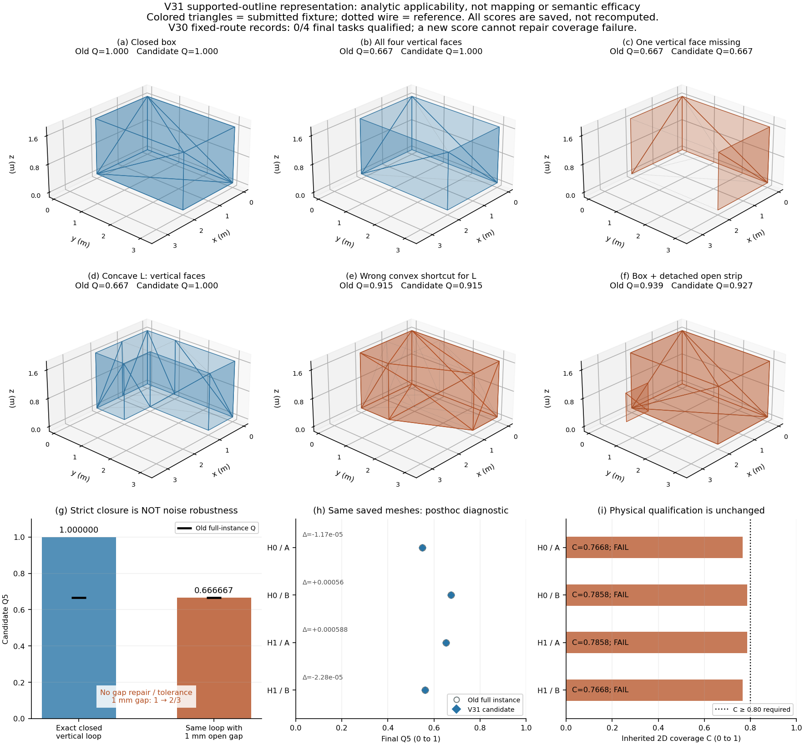

# V31：线支持外轮廓的解析验证与保存网格诊断

更新：2026-09-17。保留 ANS 层次及 OV-SDF、STGHP、RPN-UQ、IGCR 四模块；可验证语义创新仍为毕业要求。本轮完成 V31 的第一项评价适用性检查，没有启动新的物理仿真或训练。

**结论：一个明确的投影表示问题已修正，但它不足以解释旧实验的质量差距，也没有证明语义优势。** 完整准确竖面的候选外形分数由 2/3 恢复为 1；然而旧实测网格的 Q 最大变化仅 0.000588，复杂优先规则仍低于最佳固定臂。新候选对 1 mm 断环仍有明显跳变，暂不作为训练目标或取代原指标。

## 1. 本轮检验的问题

V30 已证明实际补看可以提高外形 Q，但复杂类优先未胜出，且四条任务都未达到 80% 二维覆盖。同时，原投影评价把准确竖面在 XY 中退化成的线丢弃，导致完整正确外轮廓也只得 2/3。这里需要分开回答：

1. 不增加观测、不修改重建，是否能让等价正确外轮廓得到一致评分，同时惩罚缺面、错误桥接、外扩和额外预测？
2. 修正这一实现后，原保存网格的分数与决策排序是否明显变化？

协议、夹具和候选实现均在正式执行前封存。见[主协议](V31_SUPPORTED_OUTLINE_PROTOCOL_20260917.md)、[解析夹具定义](V31_ANALYTIC_FIXTURES_PROTOCOL_20260917.md)及[执行前审查](V31_OUTLINE_CONTRACT_REVIEW_20260917.md)。本轮是开发诊断，不是独立确认集。

## 2. 实现与评价边界

新增 `nso/supported_outline_v31.py`，保留投影退化为线的有效三维三角形；只有预测本身精确闭合的投影环才形成二维外轮廓区域。非退化投影面积与这些区域合并，保留非凸和不连通外边界。区域外残留线进入按长度计算的边界 precision/recall，避免额外细条被忽略。

本候选不使用 GT 裁剪或对齐预测，不做吸附、膨胀、形态闭运算、凸包或跨缺口补线。二维闭环内部面积是外轮廓表示，不是新测得的顶面、底面或三维体积。三投影也不能识别所有投影等价的内部或三维错误，故 Q 仍不称完整三维建图精度。

仍使用每投影 `min(F1, IoU)`、三投影均值，统一保存 2/5/10 cm 阈值；不按类别加权。全部参考设施等权，漏建记零。新版本另外报告输出实例 precision，并乘到基础任务 Q/J 上，使未匹配的非空额外实例受罚；空输出槽不破坏正确归属。此项依赖输出分片方式，不能解释为自然实例识别精度。所有输入，包括未匹配输出，先检查非法三维退化三角形。基础 Q、输出 precision、历史任务资格与候选输出资格分别保存。

## 3. 解析结果与仍未解决的问题

正式运行包含 26 个合法案例的新旧评价，以及 2 次预期非法输入拒绝；29 项预声明检查全部通过。当前版本 6 项内核测试、8 项夹具测试均通过；内核修订前还执行过 5 项通过的测试，记录不覆盖。下表摘取 5 cm 结果，完整 26 例见解析证据中的 `scores.json`。

| 解析输入 | 原完整实例 Q | V31 候选 Q | 含义 |
|---|---:|---:|---|
| 完整闭合箱体 | 1.000000 | 1.000000 | 正确实体保持高分 |
| 只有准确的四个竖面 | 0.666667 | 1.000000 | 保留闭合投影线支持 |
| 非凸 L 形完整竖面 | 0.666667 | 1.000000 | 不依赖凸包填平凹口 |
| 连续 2 mm 薄壁 | 0.998890 | 0.998890 | 评价外包轮廓，不声称内部实心 |
| 缺少一个竖面 | 0.666667 | 0.666667 | 不自动补缺面 |
| L 形错误凸包捷径 | 0.915153 | 0.915153 | 错误桥接仍扣分 |
| 箱体附加外部开放细条 | 0.939394 | 0.926573 | 额外线支持进入 precision |
| 两个正确实例另加未匹配非空实例 | 1.000000 | 0.666667 | 不遗漏输出假阳性 |
| 正确竖面环仅留下 1 mm 缺口 | 0.666667 | 0.666667 | 精确闭合存在不连续性 |

重三角化、重复三角形、旋转加平移的闭合/竖面对等检查也通过。外扩、平移、空预测、缺失实例和重复归属均保留惩罚。

**29 项检查通过只说明候选符合“精确线支持”的合同，不说明带噪评价已可用。** 特别是 1 mm 缺口远小于 5 cm 边界容差，但 XY 面积仍为零，Q 从完整环的 1 降到 2/3。这一结果暴露了拓扑闭合与距离容差不一致的问题，不能用通过数量掩盖。它也不能单独证明旧实测低分都由断环造成。

## 4. 原 V30 保存网格的结果

只读 4 条旧路线的前缀与终点，共 16 份实例网格，进行 8 次候选评价。旧指标从封存结果复制，没有重算覆盖、传感或融合；预测顶点与三角形哈希均与 V30 一致。下表同时保留原窗口指标和原完整实例指标，候选只与后者比较表示变化。

| 旧 case / 选臂 | 原窗口 Q5 | 原完整实例 Q5 | V31 候选 Q5 | 原 C | C80 |
|---|---:|---:|---:|---:|---|
| 0 / H0-A，复杂 | 0.553654 | 0.549862 | 0.549850 | 0.766843 | 失败 |
| 1 / H0-B，简单 | 0.681766 | 0.673811 | 0.674371 | 0.785768 | 失败 |
| 2 / H1-A，简单 | 0.662356 | 0.652155 | 0.652743 | 0.785768 | 失败 |
| 3 / H1-B，复杂 | 0.563566 | 0.561003 | 0.560980 | 0.766843 | 失败 |

全部 8 个阶段的最大绝对 Q5 变化为 **0.000587989439**，即约 **0.0588 个百分点**。重建未改变；这不是精度提高。修复退化投影这一项不足以解释此前差距，不能因此断言所有评价问题已解决，或把剩余问题唯一归因于 TSDF。

候选 5 cm 数值下，最佳固定臂平均 J 为 **0.480041573**，复杂优先为 **0.425916242**，相对差 **−11.2751%**；交换规则/两选项 oracle 为 **0.521401988**。2 cm 和 10 cm 下复杂优先的 J 相对差也为负（−9.5530%、−11.5039%）。原 V30 窗口指标的 −11.4833% 继续保留，两种指标不能拼成一次优化前后性能比较。

以上是已看过且不合格的固定路线四格表。最佳固定臂不是允许主动探看和改选的强几何 G，交换规则也不能改名为已验证语义 S。当前不能证明复杂优先先验、完整 ANS 四模块、自然语义网络或实车方案的优势。

## 5. 执行与独立复核

| 工作 | 实际执行 | 新世界/传感/融合/主任务 |
|---|---|---|
| 解析检查 | 26 次合法候选、26 次旧评价、2 次预期拒绝；0.613 s | 全部 0 |
| 保存网格诊断 | 8 次候选评价、读取 16 份网格；30.441 s | 全部 0 |
| 独立复核 | 核验封存源、输入、产物及保存分数算术；未重算几何 Q | 全部 0 |
| 结果图 | 读取封存数值与核验过的解析夹具；未重新评分 | 全部 0 |

独立复核通过：解析 43 份源、诊断 41 份源及 42 项输入；旧 V30 的 54 份源、264 项根清单和各案例 65 项清单保持完整。29 项门、各阈值基础 Q × 输出 precision × C 及四格表算术一致。调用计数依据运行器和收据，不冒充独立系统调用跟踪。详见[独立复核](V31_SUPPORTED_OUTLINE_INDEPENDENT_REVIEW_20260917.md)。

证据目录及 SHA256：

| 目录（均位于 `audit_results/`） | result.json SHA256 | artifact_hashes.json SHA256 | 产物字节 |
|---|---|---|---:|
| `v31_supported_outline_20260917` | `cd83472f5e8cf2822100c8db2f6e5d262b59569f35a42bf8e1a9011a9f853832` | `9a7f81806dc85b223aeff56c7979e1bb40732bc700ddee601f6a0b19845f58a7` | 662354 |
| `v31_saved_outline_diagnostic_20260917` | `c2f7c628dfc08efcb9eea89ea065ba57c27bf4015a9eac76b9bf8455bb8acae4` | `feba3b44e9890c77bcf972c9478b51e9d42bbbb2e200c98193aea52656208ba8` | 538043 |
| `v31_supported_outline_review_20260917` | `2417699af80e0f88a71115a27029f68d9befab366fc1b294d523ae79541da432` | `a246f1fbe1135b0e27f1fb7743db3449da290b4140bbb3a91e023e284ff43677` | 59051 |
| `v31_supported_outline_figures_20260917`（含目录外 PNG/SVG） | `e9773b661e20f4072f0ae406bbd2853ca0a17c02b9221023aa9be2c225f286a1` | `6e8f52f12a8d4fc839bf46f0e82a2bcd940e4a2c39eaf325019feb4cc339024c` | 828827 |

本轮未清理文件。主任务累计仍 **16/36**，没有活动物理任务。新旧协议、失败和原始网格保留；无新增网络训练。论文 `.tex` 已同步本轮结论，未生成新的 PDF。

## 6. 下一步与停止条件

下一项只给一个工作日处理外轮廓的噪声适用性，暂不新建场景、扩种子或训练：先冻结小缺口、位置噪声、真实缺面、近邻分离设施和错误连接的对照，明确“距离误差可容忍”与“存在实际观测支持”的区别。候选表示只能使用预测/合法观测确定，不能看 GT 或类别后选择闭合尺度；同时报告轮廓匹配、支持缺失和额外预测，不用一个高分掩盖另一项失败。最多提出一个候选，允许一次有明确缺陷依据的修正，所有版本并列保留。

若候选无法同时避免毫米级无意义跳变和错误桥接高分，停止把当前三投影面积分数作为单一学习目标，向导师提交“任务外形表述与测量证据不匹配”的具体反例，并确定可观测表面与外形建档的评价分工。这不是降低已有语义收益门或宣称方案成功。

只有共同评价适用性与原 C80/安全返航可行性分别通过，才消耗后续主任务额度，验证类别是否能提前预测**方向相关、可兑现的质量增量与成本**，并比较有补看和改选能力的强 G。保持四模块及语义要求，2026-09-29 有效性去留日期不延长。
