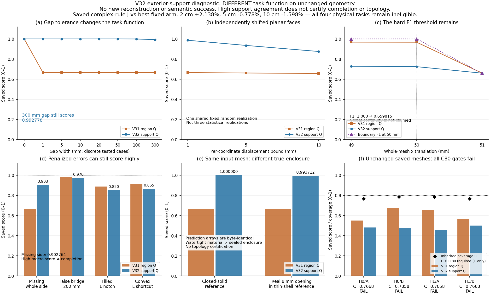

# V32：微小缺口适用性通过，当前路线的联合收益空间仍不足

更新：2026-09-17。**本轮解决了精确闭合造成的毫米缺口评分突降，但没有证明语义或完整架构优势。** 新指标只描述外轮廓支持吻合，不能代替真实表面精度、完整度或空间封闭性。原V30/V31指标与所有失败保留；没有改网格、采集、融合或训练。

## 1. 已完成的有界工作

按[执行前协议](V32_SUPPORT_BAND_PROTOCOL_20260917.md)，只实现一个候选，未使用允许的修正机会。独立几何模块固定33个噪声/缺口/错误连接/观测歧义案例，再加23个V31回归锚点，共56个合法案例。另2次非法三维退化面输入均拒绝；45项预声明门全部通过。5项内核和9项几何单元测试首次全部通过。

候选在预测支持线与参考外边界周围分别建立2/5/10cm距离带，取距离带IoU与原边界F1的较小值，再按三投影、固定设施数求均值并乘输出实例precision。距离带保留内部孔，仅用于评价，不成为占用面、不补三维表面，也不回写预测。其定义、角色及字段见协议；原区域IoU、V31区域Q、P/R、缺失与额外支持长度、尺寸和Hausdorff界始终并列保存。主诊断阈值固定5cm，未按结果挑选。

## 2. 解析结果与不能省略的反例

| 固定案例 | 原V31区域Q5 | 新轮廓支持Q5 | 解释 |
|---|---:|---:|---|
| 准确完整竖面 | 1.000000 | 1.000000 | 正确轮廓仍得高分 |
| 仅有1mm角缺口 | 0.666667 | 0.999999996 | 不再因精确断环突降 |
| 独立面片1mm扰动 | 0.665638 | 0.986750 | 当前固定扰动下保持较高吻合 |
| 独立面片5mm扰动 | 0.661556 | 0.935530 | 边界偏移仍逐步扣分 |
| 连续2mm薄壁 | 0.998890 | 0.988112 | 薄表面与距离容差下的参考外形接近 |
| 同薄壁存在1mm真实通口 | 0.666666 | 0.988177 | 高轮廓分不能认证真实封闭 |
| 缺少整块侧面 | 0.666667 | 0.902764 | XY缺失被其他两投影平均稀释 |
| 200mm邻距中的错误连接桥 | 0.984360 | 0.970218 | 仍扣分，但两个实例的宏均值很高 |
| 非凸L错误凸包捷径 | 0.915153 | 0.864600 | 不能靠凸包获得正确轮廓分 |

1mm角缺口的支持Q变化仅约4.1×10⁻⁹；2mm薄壁在出现1mm通口后变化约+0.000065。这只符合当前外轮廓容差任务，不说明通口可以忽略于导航或占用判断。三档面片扰动共享一个随机实现，不是三个独立噪声实验，更不是ZED噪声标定。

反例明确保留：

- 300mm角缺口仍有Q_support=0.992778；其XY召回为0.98，超5cm容差的参考缺失长度0.20m，但另两投影完全相同。缺整侧的XY召回仅0.71、缺失长度2.90m，宏Q仍约0.903。**高均值不能证明设施完成。**
- 整体x偏移49/50/51mm时，Q_support依次为0.728763、0.724388、0.659815；硬F1阈值的跳变仍存在。不能称指标对任意位置噪声连续。
- 同一份缺10mm角的外侧竖面观测，既与实心柜兼容，也与有8mm真实通口的2mm薄壁外壳兼容。两案例预测数组、预测支持和距离带完全相同；分别对不同参考评分约1.000000和0.993712。评价真值能不同，但仅凭给定网格不能判别真实封闭性。额外射线或新视点可能解除歧义，本轮没有声称完整传感历史也相同。
- 小于距离带直径的相邻支持带可能重叠，不能据此合并设施或认定物理连接。三种正确邻距均保持两个独立参考、两个输出及固定归属。

所有结果显式记录`connectivity_certified=false`、`completion_fraction=null`、`candidate_ready_as_sole_training_target=false`。45门通过是有界的外轮廓支持适用性证据，不是完整三维质量验证。

## 3. 保存网格诊断：排序对任务定义敏感，但仍无主指标优势

在解析门通过后，只读V30的16份保存实例网格，完成8次前缀/终点评价。网格字节不变，底层参考签名一致；同步计算的V31区域诊断在全部阈值与原封存数值一致。不同定义的绝对Q不能当优化前后精度比较。

| 旧路线 | 前缀支持Q5 | 终点支持Q5 | 原V31终点区域Q5 | 原二维覆盖C | C80 |
|---|---:|---:|---:|---:|---|
| H0-A，复杂 | 0.360529 | 0.481093 | 0.549850 | 0.766843 | 失败 |
| H0-B，简单 | 0.360529 | 0.477015 | 0.674371 | 0.785768 | 失败 |
| H1-A，简单 | 0.361589 | 0.459262 | 0.652743 | 0.785768 | 失败 |
| H1-B，复杂 | 0.361589 | 0.500136 | 0.560980 | 0.766843 | 失败 |

四条路线的支持Q均随实际补看提高。选中设施自身支持Q增量分别为0.225921、0.217740、0.176174、0.261238；同位置比较时复杂设施补看增量较大，但这仍不等于总任务中的最优分配。

| 支持指标阈值 | 复杂规则相对最佳固定臂的Q差 | 联合J=C×Q相对差 | 联合J两选项oracle相对最佳固定臂 |
|---|---:|---:|---:|
| 2cm | +3.2969% | +2.1383% | +2.1383% |
| **5cm（预定主阈值）** | **+0.4173%** | **−0.7781%** | **0%** |
| 10cm | −0.3937% | −1.5984% | 0% |

5cm时，复杂规则支持Q均值0.490614，最佳固定臂0.488575；乘入实际覆盖后，复杂规则J=0.376224，最佳固定臂J=0.379174。两个排列的联合指标都由固定B取得两选项最高值，故**当前有限路线目录连全知选择都没有主联合收益空间**。这不等于证明所有语义规划无用，但足以停止在这两条路线中训练、扩噪声种子或声称将靠更好网络翻盘。

原V31区域指标的复杂优先−11.2751%没有删除；新支持函数改变了任务定义与排序，不能把−11.2751%到−0.7781%解释为模型进步。2cm正数也不能替代预定5cm主结果。全部四任务不合格，路线选择没有实际ANS/四模块自主执行，固定臂不是强主动几何G，因此不构成独立语义效益证据。

## 4. 评价分工与下一阶段

本轮评价开发到此收束，不再为提高当前成绩追加第三个投影评分候选：

| 研究问题 | 保留的证据 | 当前边界 |
|---|---|---|
| 已有外轮廓是否在容差内吻合 | V32支持Q、逐投影P/R、缺失/额外长度、尺寸与距离 | 不能单独认证完成、占用或真实封闭 |
| 实际测得的三维表面是否准确、完整 | 须单列实际表面的3D precision/recall及任务相关可观测外表面覆盖 | V32没有新增这类准确性证明；不可把投影宏均值冒充此项 |
| 未观测区域/占用是否可确认 | 原区域IoU及可观测射线/闭合证据，推断与实测分开 | 精确断环和同网格歧义均保留，不以支持带填补 |

下一阶段见[V33有界场景信息价值计划](V33_DIRECTION_VALUE_SCENE_PLAN_20260917.md)：停止当前固定目录扩量，先筛查“类别提前预测值得付费观察的方向”能否在新任务中产生足够价值，同时保留几何G补看、识别后改选和返航能力。先求公平有限模型的信息上限并检查C80可行性，未过门不消耗新主任务或训练。四模块和可验证语义要求保持，2026-09-29去留日期不延期。

## 5. 成本与证据

解析执行1.067秒，56次合法候选评价、2次预期拒绝；每合法案例内保留原区域Q，无单独旧评价器调用。另为同输入歧义核对执行6次预测投影提取和18次距离带构造，不冒充零几何调用。保存网格诊断33.390秒、16网格8次候选评价。世界、传感、mapper/TSDF、网格重新提取、新主任务均0；配额仍16/36。未清理旧文件。

| 证据目录（`audit_results/`） | result SHA256 | inventory SHA256 | 字节 |
|---|---|---|---:|
| `v32_support_band_20260917` | `9a532e0283e92e3c933148cc5dd45c00e98f853cf99ab85508e11d9ee6935f35` | `da694937495016aee42323d1ef2a81b1d6a978c3a4cbf5268090dddcbc922252` | 1233978 |
| `v32_saved_support_band_20260917` | `a8f2f4266be30e1fabdcfeff694ad006ff9daa1a1db2aa735a333553256d01e5` | `5cbe1a7f104e1e29f9fb67ce2c62df2e962f036dbacf5a412bae34dabbbc849d` | 655499 |
| `v32_support_band_review_20260917` | `77270ef4f99a0def9892099a1eda2ae1ecc07f0e908e904a6a4fb7dec57fdfd2` | `711f295e361e6da8847f60df64852f226b0e2e29f9828c339803c5b1d5acabd1` | 143899 |
| `v32_support_band_figures_20260917`（含目录外PNG/SVG） | `ad1a1f4423e094975e1fe25e7a44d95481edae7ba61014beb8cc6524379ee54b` | `41f7099ca1519cf5e866bebd1d8477836a54b992effde921eaf6a4fa463cb154` | 367613 |

解析封存47源，保存诊断封存42源和45项输入。[独立复核](V32_SUPPORT_BAND_INDEPENDENT_REVIEW_20260917.md)通过全部56+8结果的三阈值算术、45门、来源ZIP和输入；旧V30的54源、264根库存及4×65案例库存保持原身份。复核没有重新运行几何Q，表示等价的WKB判断按冻结运行收据核对。图表只读保存数值，未新增评分。

四份证据与图共2,400,989字节。论文源码、Goal和权威JSON已同步；当前无LaTeX编译器，未生成新PDF。

