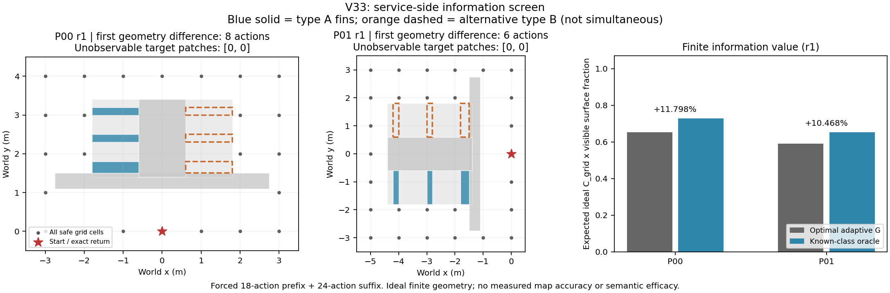

# V33服务侧方向信息价值筛查

2026-09-17。本轮是CPU解析开发筛查，保留ANS层次和OV-SDF、STGHP、RPN-UQ、IGCR四模块要求；没有运行四模块、World、传感器、mapper、TSDF或实际外形评价。主任务仍16/36，2026-09-29有效性去留日期不变。

**结论：唯一修正版r1通过两个父布局的有限信息价值筛查。** 正确类别信息相对最优主动几何G的联合可见性代理提高11.798%和10.468%。这是继续做像素传感与实测重建检查的依据；还没有证明可实现语义网络、ANS四模块整体或真实建图精度的增益。

|父布局|最优G的期望J_potential|正确类别oracle|相对信息价值|全部保存见证的终点C_grid|
|---|---:|---:|---:|---:|
|P00|0.651939655|0.728855364|+11.79798%|22/24=91.6667%|
|P01|0.590820313|0.652669271|+10.46832%|25/28=89.2857%|

## 本轮具体检验什么

问题由“复杂类别是否应该多看”收窄为“类别提前提示哪侧有可兑现的外表面，是否比先探看再改选节省预算”。同一个设备的两种制造构型把服务肋布置在相反侧；前部护板和单线雷达截面相同，类别只提供type_A/type_B，类别—局部服务侧关系是双方共同知道的结构模型。第二父布局更深、肋间距不同，并旋转90度，类别不是绝对世界方向标签。

这只是单设备原型，不是大规模设施场景，也没有验证自然图像能识别这些类型。正确类别oracle假设已经知道构型；它的成绩仅回答该信息在模型内是否有价值。

无类别G使用公共完整安全图和两种构型先验，可以走全部合法路径、主动探查、在几何首次可区分后立即识别并改选。与oracle共用观测、动作、预算和返航要求。先前固定A/B目录不能替代本轮G。

双方强制支付同一18动作前缀，再在24动作内自由优化，并返回原位置和朝向；最优性范围仅是这一有限合同。没有证明从动作0自由规划42动作或连续运动的最优性。全景激光的地面中心LOS给出覆盖代理C_grid；准确Box并集的外露竖面按小块中心估计可见面积F_surface。两者联合为J_potential=C_grid×F_surface，逐世界要求C_grid≥80%。未知构型时优化期望乘积，不以一个分支失败换另一个分支高分。

这些数值不是实际地图C、表面精度、外轮廓Q或实测联合J。2/5/10cm字段全部为null/untested，不把理想可见面积写成三组精度试验。

## r0：收益计算前发现几何缺陷

首版两父各两假设，共4张解析表。完整导航、连通、公共前缀相同、镜像参考面积一致均通过，但每个假设都有22个代表块、3.26平方米参考竖面在冻结网格的全部可达视点中不可见：18块/2.94平方米位于护板与第一肋之间0.1米槽中，4块/.32平方米位于高于脊柱的护板背面顶带。

这是指定相机高度和离散网格下的不可观测性，不是证明任意连续相机都看不到。按预声明停止条件，两父均未运行收益求解，不能称r0语义失败或成功。P00/P01准确竖面分母分别40.52/44.12平方米，前缀覆盖代理分别62.5%/60.7143%，第一几何区分距离为前缀后8/6动作。

r0完整保存在`audit_results/v33_direction_information_r0_20260917`；14份源封存，6文件792,484字节。结果SHA256为`47b21ba99d5253c7c17f30dfcf3b5faf3405bf07e05ad292bd73dbd1e65584e3`，目录清单SHA256为`cd8a7405bab30e5caa75660b49eda7c1e5a039268b3c77011931a54314efd6b5`。

唯一r1修正仅处理上述缺陷：两父护板高度2.0→1.8米，第一肋前缘1.6→1.5米，实体填实窄槽。重新计算真实并集与全部参考面，不能在评价端删去不可见块。预算、导航域、传感参数、其余肋、目标函数和5%筛查门均不因成绩调整。r0保留，r1后不再增加第三版。

## r1完整结果与信息因果解释

唯一修正将P00/P01真实参考竖面分母改为34.80/38.40平方米，每个减少5.72平方米：护板降低贡献−2.36，填槽净贡献−3.36。这不同于r0不可见的3.26平方米，不能解释为仅剔除难面，也不能比较r0/r1分数后声称重建提高。四个实体的体积各减少.272立方米，导航图、全部19个前缀姿态不变。几何修正与生成器完整来源见[V33_R1_GEOMETRY_CORRECTION_20260917.md](V33_R1_GEOMETRY_CORRECTION_20260917.md)。

两父全部几何门通过，四个假设都没有不可见目标块。随后4个精确求解实例共搜索30,306个memo状态，无删失，未触及300秒/150万状态上限；包括每父主信念求解和同结构控制。正式r1总耗时约.487秒。没有按结果再调几何、预算、采样或门槛。

|父布局/政策|h0的F_surface|h1的F_surface|h0的J_potential|h1的J_potential|
|---|---:|---:|---:|---:|
|P00 G|.795114943|.627298851|.728855364|.575023946|
|P00 正确类别|.795114943|.795114943|.728855364|.728855364|
|P00 交换类别后可几何纠正|.627298851|.627298851|.575023946|.575023946|
|P01 G|.730989583|.592447917|.652669271|.528971354|
|P01 正确类别|.730989583|.730989583|.652669271|.652669271|
|P01 交换类别后可几何纠正|.592447917|.592447917|.528971354|.528971354|

12条见证均完整使用18+24=42动作、精确返航，并在真实假设的覆盖代理下合格；交换类别也没有屏蔽之后的几何纠正。类别正确与否不改变任何表面的评分，区别只在先去哪侧和剩余观察预算。

P00的最短几何识别距离为后缀8动作，但最优G所保存的见证在后缀10动作才揭示；主动追求最早知道不必等于最高终点收益。两假设G此前动作完全相同，第11个动作开始分支，实际体现了信息后改选。P01最短距离与见证揭示均为6动作；虽然此后允许全部重新选择，所保存的两条最优G见证仍全程相同，不能写成两个父都实际改道。正确类别在h1的第一个后缀动作就选择另一侧；它避免了先验不确定性导致的初始方向选择损失。

同结构双假设的G/已知最优值完全相同，类别增益为0；因此不是额外标签自动加分。免费几何提前揭示在代数上等同正确类别oracle；无关类别不改变后验，最优值仍为G。这两个是模型干预的数学等价关系，不是新增物理实验。交换类别的见证分数下降且仍可纠正，支持“先验方向正确性”这一模型内机制；未验证噪声类别、识别代价或真实策略学习。

r1封存在`audit_results/v33_direction_information_r1_20260917`，15源、8文件751,591字节；结果SHA256为`1f925ff0d2cfa6b4b715bf61a336331853a1a5da2ac7c679228b2514d0b68c02`，目录清单SHA256为`95f318a3dfdc44812fce123d42d02363559437985feb54f48933aa9268eeb946`。r0+r1共8个解析几何模型、4个求解实例，物理调用全0。

## 下一阶段边界

信息筛查通过后，冻结r1场景，不再追求更高的解析百分比。下一步是检查真实像素/单线/栅格覆盖及开源TSDF能否兑现同方向的实际表面质量改善，详见[V34_MEASUREMENT_GATE_PLAN_20260917.md](V34_MEASUREMENT_GATE_PLAN_20260917.md)。先做无主任务的接口与离线测量合同检查，尚不能立即使用剩余全部任务额度。

必须保留的未通过项是：实际C80、2/5/10cm表面精度与完整度、有效且可读的类别线索、连续或更细动作下的取舍、无强制前缀自主策略、自然语义泛化、ANS四模块兑现及实车。当前`physical_experiment_ready=false`、`semantic_efficacy_proven=false`、`full_architecture_advantage_proven=false`。V30四条实际C80失败、V32当前固定目录主J信息价值0和所有旧负结果均不变。

## 核查范围

新有限信念求解器已通过17项独立合同测试，其中60组值与无缓存完整观察历史策略枚举一致；场景组装通过6项安全、并集、遮挡和公开信息合同测试。求解器测试中的一次手写夹具预期错误及其修订另有记录，不能当成未发生。正式结果必须结合冻结源码、表、见证和独立复核理解。

[独立保存证据复核](V33_DIRECTION_INFORMATION_REVIEW_20260917.md)已通过：逐项核r0/r1来源、完整安全图、保存mask→C/F/J、12条动作与返航、信息首差和配对均值。复核未重算可见性或DP，不能称另一个独立主场景最优证明。最终包为`audit_results/v33_direction_information_review_r1_20260917`，结果SHA256为`9d7ba2c22f6dea18a473f68f241ece3f9eafb51fb9ff6cd182e108aadd65885d`。初次复核器误用浮点精确相等，1.11e−16差导致检查失败；失败源和收据均保留，仅修为原合同1e−10容差，未更改主结果。

图从封存表读取，不新构模型，原PNG/SVG和绘图来源由`audit_results/v33_direction_information_figures_20260917`记录。本轮所有8个V33证据目录的完整库存已在主线程再次核对，r0/r1当前源与ZIP字节一致；未清理旧文件。所有结果为开发证据，独立场景确认仍未完成。

执行协议：[V33_DIRECTION_INFORMATION_PROTOCOL_20260917.md](V33_DIRECTION_INFORMATION_PROTOCOL_20260917.md)；初版几何：[V33_DIRECTION_SCENE_GEOMETRY_20260917.md](V33_DIRECTION_SCENE_GEOMETRY_20260917.md)；求解器合同：[V33_FINITE_SOLVER_REVIEW_20260917.md](V33_FINITE_SOLVER_REVIEW_20260917.md)。
