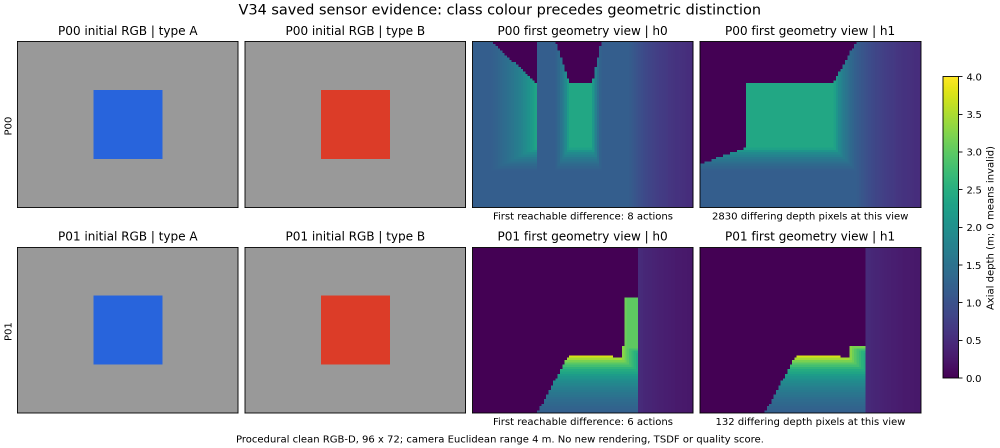
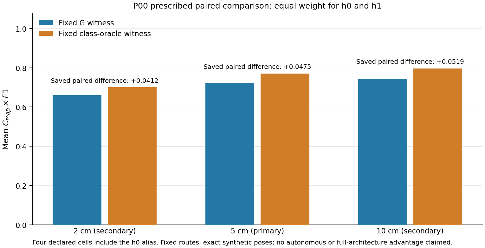

# V34 像素信息与固定路线实测结果

2026-09-18。承接V33 r1唯一场景修正；本轮不改变几何、42动作预算、18动作公共前缀或两父布局。保留ANS层次与四模块作为后续系统约束，本轮固定路线不运行四模块。

## 像素信息验证

新适配器分别处理4米相机和8米单线雷达量程、旋转后的人工类别标记、切向扫掠与完整栅格覆盖分母。10项传感合同、11项表面测量、3项保存奖励适配测试通过。正式信息检查查询P00/P01两个构型的全部416姿态，保存RGB、深度、单线、位姿及标定数组；4个World、416个packet，没有动作执行、地图融合或质量评价。

每个构型的公共前缀中均有8帧、7个不同XY位置读出正确类别，0矛盾。去掉类别颜色后的RGB、深度、雷达与位姿前缀一致；P00/P01最短几何首差仍为8/6动作。以真实像素信息分区重新求解原有限奖励，4个DP实例共30,306个memo状态；两父正确类别oracle相对G仍为11.79798%/10.46832%。保存证据独立复核核验416组数组与12条见证，没有重新渲染或求解。

图中的颜色是人工受控类别编码，不是自然语义网络。有限求解奖励仍是理想中心覆盖与可见竖面面积，不能将上述百分比称为重建精度改善。P00/P01完整.2米栅格可达分母为588/668，与24/28个整数中心不同，后续资格使用前者。

## 固定测量设计

预先冻结[固定测量协议](V34_FIXED_MEASUREMENT_PROTOCOL_20260918.md)和[表面合同](V34_SURFACE_MEASUREMENT_CONTRACT_20260918.md)。首批P00两构型×G/oracle四比较格，h0两路线完全相同，执行前声明alias，共3条唯一采集；每条初帧加42动作后帧，共43包。G和oracle均直接执行有限模型保存见证，不是以带噪地图在线规划的策略。

使用同一CPU Open3D TSDF，体素4厘米、截断12厘米；双目误差模型固定iid_025px/seed1901，位姿精确。类别不进入融合、补全或指标权重。公共ROI取两个构型包络并集，外扩.2米；仅去除已知地面附近近水平片，保留ROI内错误几何，不以GT吸附、配准或封口。ROI外误差另列裁剪面积，但不计入主precision。

主量为实测地图覆盖C_map乘表面F1@5cm；2/10cm同时报告。precision针对完整GT表面距离，recall针对全部外露竖面，均32768固定面积样本。所有预测快照与原始包先封存，再在评价侧读取GT。终点覆盖至少80%、42步内精确返航、零执行碰撞均为硬门；失败停止后续新任务。每条完整采集都须另起进程、重新生成传感并融合，再逐数组核对两阶段网格、地图与评分。

## 实测结果

3条唯一采集和3次独立进程回放全部完成，4个声明比较格完整。三条均42动作、零碰撞、精确返航，观测footprint冲突也均为0；终点C_map均563/588=95.7483%，通过80%门。实际整数中心覆盖22/24=91.6667%仅作辅助，不能取代完整栅格分母。

| 构型／路线 | 前缀F1@5cm | 终点P@5cm | 终点R@5cm | 终点F1@5cm | 终点J5 |
|---|---:|---:|---:|---:|---:|
| h0，G与oracle共用 | 0.449882 | 0.874542 | 0.748444 | 0.806594 | 0.772300 |
| h1，G | 0.451039 | 0.862396 | 0.596466 | 0.705193 | 0.675211 |
| h1，oracle | 0.451039 | 0.878204 | 0.742096 | 0.804433 | 0.770231 |

前缀C_map均419/588=71.2585%，它是观察响应检查点，不是完整任务。h1定向路线使终点recall比G提高14.563个百分点，F1提高9.924个百分点；precision提高1.581个百分点。因而改善主要是外露表面完整度，不能笼统写成坐标精度提高6.56%。h1两路线的预测面距离均值为6.432/5.957厘米，参考竖面距离均值为27.614/12.899厘米；其余mean/RMSE/P95均保存在case结果，未忽略较大尾部误差。

| 距离阈值 | G的等权平均J | oracle的等权平均J | 绝对差 | 相对差 |
|---|---:|---:|---:|---:|
| 2cm | 0.659817 | 0.701046 | +0.041229 | +6.2485% |
| 5cm（主量） | 0.723756 | 0.771266 | +0.047510 | +6.5644% |
| 10cm | 0.744624 | 0.796542 | +0.051918 | +6.9723% |

5cm为正且2/10cm方向一致，固定测量准入门通过。h0为同一轨迹故差值严格为0，所有增量来自h1；只有一个父布局、两个成对构型、一个噪声种子，不能以四比较格或三次回放扩大统计样本。此处oracle只是在原有限可见性代理下按已知类别求得的路线，不是实际TSDF质量的全局最优上界；G也是代理最优见证，不是对实测J重新优化的强在线方法。

两个构型的公共前缀（初始帧＋18个付费动作后的帧，共19帧）在所有非类别字段上完全一致，人工类别仍能在7个不同XY位置识别。G两构型的实际深度首差在总动作28、轨迹首差29；oracle在动作19转向分叉，该时刻的深度不同来自已选不同朝向，不能说构型在相同视点提前泄漏。

ROI外裁去面积在三条终点分别为16.3585、17.2344、16.3747平方米，包含公共ROI外的地图表面；这些面积不受主precision惩罚。[独立后验复核](V34_FIXED_MEASUREMENT_INDEPENDENT_REVIEW_20260918.md)首次通过，重新核对129个主原包、两阶段地图覆盖、预测冻结清单、几何与裁剪账本、主／回放封存和均值算术。它未重新渲染、融合或评分；新进程物理回放属于前述单列的3次执行。

主采集及独立回放各3个World、129包、126动作、129次TSDF融合、6次网格提取和6次阶段评价。所有原包字段、轨迹、两阶段地图／原始与提取网格、裁剪账本、参考与分数在新进程中一致。首次回放启动因不同工具会话重复局部PID=2被守卫拒绝，发生在建立回放目录或任何World之前；拒绝记录保留。随后用全新Python父进程启动独立子进程执行同一封存源码，不修改PID守卫，首次实际回放通过；没有重复采集或丢弃失败分数。

源冻结61项，本批全部产物约7.48MiB，每case含回放约2.33–2.47MiB。新增主任务3，累计19/36；未启动自主开发或独立确认，未清理旧资产。正式结果SHA256为`a95cb49901cd71523fde07241648268cd9fca30797781d78b80b6130d4d75e16`，完整封存索引为`4fead354291efad4236ddc8ef8ec217971aa4b763651bf53aafe7caf3d7dd28e`。

## 当前判断与下一步

本轮支持“在此预先固定的人工服务方向场景中，提前获知构型可选择更有效的定向观察路线，并经带噪深度与共同TSDF得到实际表面收益”。因此可以继续验证可实现在线策略，已有依据超出理想可见性分数。它仍不能证明完整方案，特别不能把固定oracle路线称作自然语义网络或ANS闭环。

下一阶段按[V35在线语义准入计划](V35_ONLINE_SEMANTIC_GATE_PLAN_20260918.md)，把类别后验、共同主动几何辨识、预算规划和观测反馈接到四模块中。先用保存数据检查决策因果和真值隔离，再冻结最多8条自主开发任务；不追加本批固定路线、不改变几何和测量门。2026-09-29去留日期和后续8条确认上限不变。

## 证据入口

- 像素正式证据：`audit_results/v34_pixel_information_20260918`。
- 像素独立复核：`audit_results/v34_pixel_information_review_20260918`，及[复核说明](V34_PIXEL_INFORMATION_INDEPENDENT_REVIEW_20260918.md)。
- 测量夹具：`audit_results/surface_measurement_v34_unit_20260918`；传感夹具：`audit_results/v34_sensor_contract_tests_20260918`。
- 固定采集与回放：`audit_results/v34_fixed_measurement_20260918`，以最终封存状态为准。

自然语义、在线G/S优势、ANS四模块整体收益、位姿估计SLAM及实车效能均须另验；有限人工场景和确定性回放不能代替独立确认。
