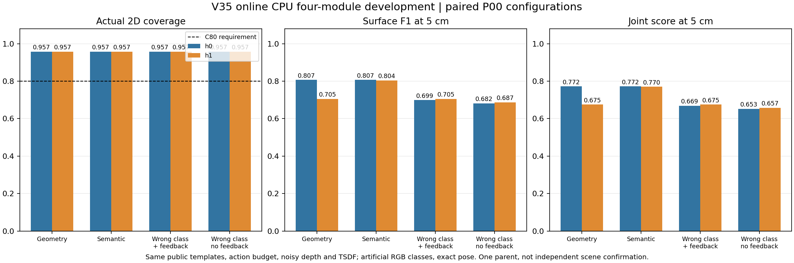
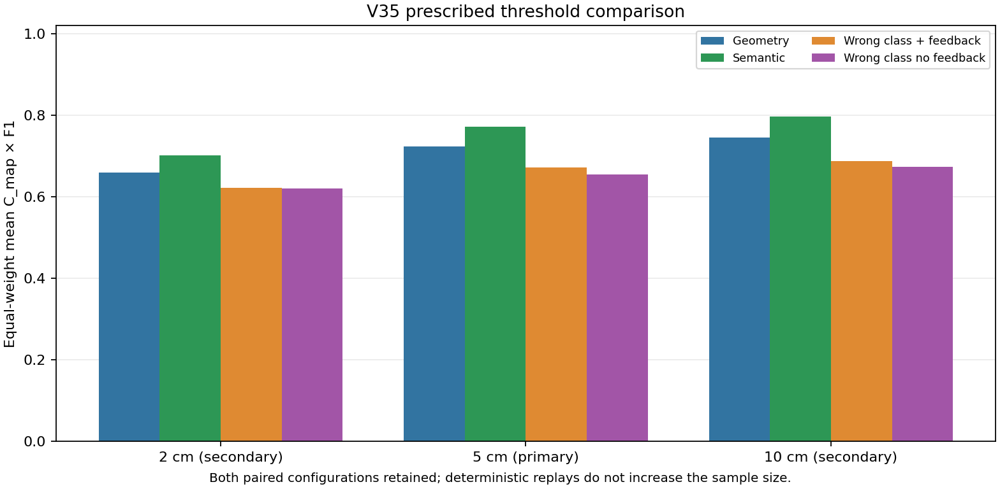

# V35 在线语义与观测纠错：开发结果

2026-09-18。本轮完成8条在线主任务及8次独立在线回放，独立复核的完整开发门通过。在P00受控设施任务中，保留四模块职责与层次的CPU方案相对共同主动几何基准，主联合指标提高6.5644%；误导类别下启用观测纠错相对关闭纠错提高2.6241%。这把V34的固定路线收益推进为当前观测驱动的在线机制证据；自然语义、跨场景泛化及原神经ANS整体优势仍待验证。

## 从固定路线到在线决策

旧V33求解器的`witness(actual,...)`依赖实际构型，且任何模板签名差异都立即揭示身份，不能作为带噪在线策略。本轮新增`online_planner_v35.py`、`observation_belief_v35.py`、`cpu_four_modules_v35.py`，旧冻结源码保持不变。

控制器只接收已付动作与位姿、RGB、深度、扫描、碰撞和可选实测地图摘要，不读实际hypothesis、episode身份、GT评分或未来实际数据。G/S共享两个公开CAD模板及其预测深度／雷达、同一安全图、动作能力、覆盖／返航约束和规划算法。S只增加实际RGB得到的类别先验；模板预计曝光与实际TSDF分开保存，不能当作重建完成度。

类别须在两个不同XY位置获得16像素支持，才赋予一次0.9先验；重复观看不继续强化，矛盾类别清空先验。实际几何残差用冻结的鲁棒视差／扫描伪似然更新概率，每个姿态只计一次，错误类别可被新证据纠正。这些概率未经校准。规划每次预测至多一个可靠度假定为0.99的未来信息事件，两种观测结果都按Bayes后验计算；实际执行每步更新再规划。它是有界近似，不是精确带噪POMDP或训练过的风险网络。

OV-SDF保存观测与类别状态，IGCR作实际残差反馈，STGHP进行全剩余预算的全局选择，RPN-UQ核局部动作和返航余量。全局输出当前长视界的下一姿态子目标，局部执行1米／90度原语；保留层次和四模块职责，但不称运行原ANS神经模型。

## 先于实测的实现准入

当前后验、规划器、控制器各11项测试通过，共33项。规划器另与45组先验／观测可靠度／预算穷举结果核对，全部一致。后验首次10项测试的原源与结果保留；只读审查发现同帧双类别冲突需要清先验，按既定合同修正并增加测试，未改噪声、几何、收益或效能阈值。

在V34已保存带噪轨迹中，两构型错误先验在动作28首次被有效几何证据从真实类别概率0.1纠正至0.978178；G此时为0.997527，关闭反馈保持0.1。这只是识别响应，不单独作为性能改善。

唯一正式缓存观测批共8条闭环（两构型×G/S/错误类别/错误类别关闭反馈），全部42个名义动作返航、双模板覆盖代理合格、四模块实际调用。h0的S与G同动作，h1的S在动作19改变方向。两构型错误类别加反馈相对去反馈均在动作29分叉。

为排除“对未来信息的预期”造成的混淆，按预先约定的首次纠正规则，两例均取动作28之后的状态，固定节点、曝光、剩余14步、已访问节点和相同未来观测设置，仅把后验换回错误语义先验：h0由forward变为left，h1由forward变为right。两例都支持实际后验纠正导致下一动作改变，不是从后续很多状态中挑选。

另两条去类别前缀中，S状态及首决策与G相同。正式准入共10个控制器、382次缓存数组消费、372个名义动作、194次在线规划和2次后验干预，合计305,478个memo状态；7项准入门全部通过。没有World、renderer、新传感包、TSDF或新Q，主任务仍19/36；这些缓存结果不能称带噪闭环或实际主任务。

## 正式实测设计

按[采集协议](V35_ONLINE_DEVELOPMENT_PROTOCOL_20260918.md)，固定P00两构型×G、S、swapped、swapped_no_feedback共8条真实在线采集，不因缓存同路而合并。每条须重新从当前观测产生动作，再独立进程重建传感、控制器决策与TSDF。42总动作／18前缀、相机／雷达、iid_025px/seed1901、同TSDF与公共ROI、C_map80及P/R/F1@2/5/10cm均保持V34合同。

事先固定三个比较：S−G、S−错误类别、错误类别纠错−关闭纠错。门要求三个主均值为正，且S−G在2/10cm不反向，并有真实反馈后的行动证据。现已通过；四模块闭环与配对效能共同支持当前CPU方案，不能将四接口被调用解释为每一模块均有独立性能贡献。

## 实测结果与边界

8条任务均42个付费动作、零碰撞、零足迹冲突、精确返航，实测二维覆盖率均为563/588=95.7483%。每次独立回放重新生成观测、重建TSDF并重新在线选择动作，全部保存包、后验、动作、地图、网格和评分匹配。没有任务别名合并、执行失败、补跑或依分数改参。

主指标J5=C_map×表面F1@5cm；相对改善为两构型等权均值之差除以对应基线均值。

| 方法 | h0 J5 | h1 J5 | 等权均值 |
|---|---:|---:|---:|
| G：共同主动几何规划 | 0.7723003000 | 0.6752107623 | 0.7237555311 |
| S：正确类别＋几何反馈 | 0.7723003000 | 0.7702313575 | 0.7712658288 |
| X：交换类别＋几何反馈 | 0.6692980823 | 0.6752107623 | 0.6722544223 |
| Xnf：交换类别、关闭反馈 | 0.6527271203 | 0.6574026472 | 0.6550648838 |

S相对G平均绝对增加0.0475103、相对+6.5644%；S相对X为+14.7283%；X相对Xnf为+2.6241%。G可以主动补看、获取几何信息和改变选择，双方共享规划器与公开模板。Xnf同时关闭实际几何后验更新与未来几何纠错预期，因此终点比较估计整个反馈策略的效应。

h0的S和G轨迹与分数相同，语义平均增量来自h1，不能写成两个构型均有语义额外收益。S−G在2/10cm阈值平均相对+6.2485%/+6.9723%。X−Xnf在2/10cm平均相对+0.3952%/+2.0902%，但**h1的2cm绝对差为−0.0021593573**，须保留这一负结果，不能声称所有阈值、所有构型的反馈均改善。

## 语义和反馈确实改变了什么

第6步观测形成一次0.9类别先验；18步共同前缀结束时，h1的G/S完整非语义观测、位姿和曝光状态相同，尚无区分构型的实际几何证据。S第19步选择right，G选择left，最终取得不同实测质量。这支持类别知识提前选择有效观察方向；并非人为禁止G补看。

两种构型的X都在第28步首次将真实构型的模型概率从0.1纠正至0.978178，第29步执行forward；Xnf分别执行left/right，此前非语义观测历史完全相同。本批没有在实际几何证据到来前因未来反馈开关而提前分叉。

[独立复核](V35_ONLINE_SEMANTIC_INDEPENDENT_REVIEW_20260918.md)严格只取两条X的首次纠正状态，固定节点、两模板曝光、已访问节点、剩余14步及相同未来信息开关，仅还原错误类别先验。两次预定反事实分别把下一动作改为left/right，支持实际后验更新导致行动改变。共2次额外DP、1264个memo状态，无新World、传感、TSDF或Q。反事实没有新物理终点，不能把全部终点差精确归因于单次动作。

## 工作量、解释范围与下一步

主采集与独立回放各为8World、344包、336动作、344次TSDF融合、16次网格提取／评价阶段、192次在线规划及289,732个memo状态。累计主任务由19增至27/36，无活动采集。33项实现测试、一次正式缓存准入、一次独立缓存复核、8主采集／8回放及一次实际链条复核均完成。后验包首次打包的导入路径失败记录保留；修正仅限打包调用，不影响冻结的算法或主任务。

现在可以回答：**在当前受控开发任务中，完整CPU流程具有语义增益与误导先验纠错收益，信息—动作—实测质量链条成立。** 实际任务价值是覆盖约束下，在有限时间中提前选择设施适合的观察侧，避免先近看辨识再改向的代价；不是泛称“语义越高，多看就必定增益”。

本轮始终限定为单父、两个成对构型、人工RGB类别、公开双模板及安全图、精确模拟位姿、18动作共同前缀。评价使用公共ROI，ROI外错误不计入precision；规划的模板曝光代理也不等于实测质量。自然开放词汇、未知环境、大尺度、定位误差、完整神经模型及实车效果须另验。不将确定性回放作为新增独立样本，不作统计显著性结论，不跨版本比较不同指标声称算法进步。与主流完整系统的优势和相对既有文献的新颖性仍需单独论证。

下一阶段按[V36冻结确认计划](V36_FROZEN_CONFIRMATION_PLAN_20260918.md)进行P00/P01×两构型×G/S的最多8条确认，使用事先指定的未用噪声种子，不调算法、几何或指标。P01已做理想模型检查，因此是跨父物理和噪声留出确认，不是完全未见场景的泛化测试。当前未开始V36，2026-09-29决策日期不延长。

## 证据入口

- 后验测试与保存带噪诊断：`audit_results/v35_observation_belief_tests_20260918`。
- 独立规划穷举：`audit_results/v35_online_planner_toy_tests_20260918`。
- 四模块接口测试：`audit_results/v35_four_module_controller_tests_20260918`。
- 正式缓存准入：`audit_results/v35_saved_observation_gate_20260918`，result SHA256 `190977a316e8c8165217884ba29af3d635358ee5e0f9e662816e8ddaee94e9a0`。
- 正式在线批：`audit_results/v35_online_development_20260918`，result SHA256 `23bdcf381ccf5654d1f1bb57d933c882175e4c52af225af92c3287decb2af938`，final seal `309a97a3b7ea11169185e47d1ecbec8ad252795af98daeef84bee37b38b3efa4`。
- 独立实际链条复核：`audit_results/v35_semantic_chain_review_20260918`，result SHA256 `971dce028f694bcfc09a5f2e6f351fc3bfc100cf2a3709eb45cb077639196749`，inventory `2ee72d295aa44c50329325b722b61283788c6491cb728b2fe95a86a4778d4168`。该结果的`complete_development_gate_passed=true`为完整门；原主批的`overall_online_development_gate_passed=null`记录当时尚待独立审计，保留不回写。
- 图表从封存评分生成：`audit_results/v35_online_semantic_figures_20260918`；未重新计算质量或调用控制器。
- [原V35计划](V35_ONLINE_SEMANTIC_GATE_PLAN_20260918.md)与两个预注册协议保持原样；后续只遵循新的V36计划。
