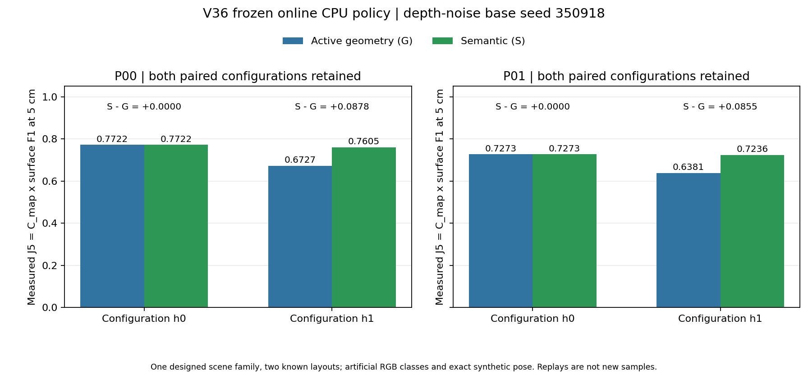
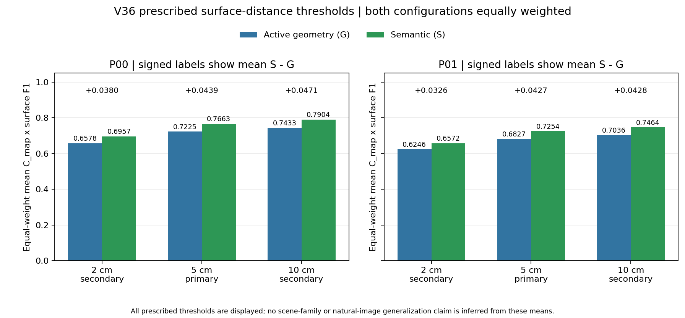

# V36 冻结策略的跨父与噪声留出确认结果

2026-09-18。**8条主任务及8次独立在线回放全部通过，独立复核的完整确认门通过。** 保持V35算法、场景、预算和指标不变，固定未用基础噪声种子350918后，P00/P01两父布局的语义相对主动几何基准平均J5分别提高6.0732%和6.2596%，两父等权提高6.1638%。两个父在2/10cm阈值也各自为正。

这说明此前收益并非仅出现在P00原有噪声实现中，支持当前四模块CPU方案在该受控场景族中的条件有效性。P01已参与理想几何及全视点筛查，不能把本轮称为完全未见场景泛化；人工RGB类别、公开模板与安全图、精确位姿等限制继续有效。

## 冻结和实际执行

严格执行已提交的[V36计划](V36_FROZEN_CONFIRMATION_PLAN_20260918.md)和采集前的[执行协议](V36_ONLINE_CONFIRMATION_PROTOCOL_20260918.md)：P00/P01×h0/h1×G/S，固定8格顺序，每条紧跟独立回放。新环境只在首次观测前把基础noise_seed从1901替换为350918；后验、规划器、四模块控制器、TSDF与评价器的V35/V34源码不变。

prepare冻结105个源文件、609项输入、两父各自的地图尺寸／坐标平移／公共ROI／预测信息节点及全边安全检查，不执行World、策略DP或Q。前缀等价仅在同父内比较。10项适配测试及P01的112节点、292边、保存数组与相机／扫描校准通过；它们没有构造真实World。

每条在线任务从当前付费RGB-D、雷达和观测位姿更新四模块，主动决定下一动作。G和S均可补看、取得几何信息和改选；S只增加RGB提供的类别先验。完整轨迹、后验、两阶段地图与网格先封存，再访问GT评价。独立回放重新生成观测、在线规划和融合，不播放主任务动作串。

8条任务均42付费动作、零执行碰撞、零足迹冲突并精确返航。P00实测覆盖率563/588=95.7483%，P01为633/668=94.7605%；均超过80%门，每父各方法覆盖相同。所有任务、回放、批次分析及正式独立审计均首次成功，无别名合并、主任务失败或重试。

## 实际表面质量与联合收益

J5=C_map×表面F1@5cm。以下按同父同构型配对；平均相对差为均值之差除以对应G均值，回放不增加样本量。

| 父布局／构型 | G的J5 | S的J5 | S−G绝对差 |
|---|---:|---:|---:|
| P00／h0 | 0.7722003956 | 0.7722003956 | 0 |
| P00／h1 | 0.6727034516 | 0.7604560086 | +0.0877525570 |
| P00等权均值 | 0.7224519236 | 0.7663282021 | +0.0438762785（+6.0732%） |
| P01／h0 | 0.7272806784 | 0.7272806784 | 0 |
| P01／h1 | 0.6381177573 | 0.7235862148 | +0.0854684575 |
| P01等权均值 | 0.6826992179 | 0.7254334466 | +0.0427342287（+6.2596%） |
| 两父等权 | 0.7025755707 | 0.7458808243 | +0.0433052536（+6.1638%） |

两父h0的S/G动作和分数均相同，两个h1提供正增量，不能声称每个实例语义都提高质量。两父h1的F1增量主要伴随recall改善：P00从0.595795至0.724945，P01从0.555450至0.684509。precision和完整度共同构成F1，不把J增加6.16%改写成定位精度提高6.16%。

| 阈值 | P00相对平均收益 | P01相对平均收益 | 两父等权相对收益 |
|---|---:|---:|---:|
| 2cm（次要） | +5.7703% | +5.2235% | +5.5040% |
| 5cm（主要） | +6.0732% | +6.2596% | +6.1638% |
| 10cm（次要） | +6.3341% | +6.0809% | +6.2110% |

本轮每父h0三阈值差均为0，h1三阈值均为正；未发生阈值反向。V35错误类别纠错的h1在2cm负差仍保留，不能因本轮G/S结果为正而删除。

## 类别确实影响在线选择

[独立实际复核](V36_ONLINE_CONFIRMATION_INDEPENDENT_REVIEW_20260918.md)检查全部344个保存包、后验记账、四模块调用、动作连续性、原始非语义哈希、地图尺寸、覆盖和评分算术。

P00和P01的h1均在观察步18之后首次作自主选择：S下发right、G下发left，作为第19动作执行。此时两者完整非语义历史、位姿、公开模板可见区域mask相同，均未取得区分构型的实际几何反馈；S后验为(0.1,0.9)，G为(0.5,0.5)。两条配对随后分别产生上述正的终点差。这将类别输入、行动变化与实测质量对应起来，而非仅证明接口被调用。

两个h0均无动作分歧，与零额外收益一致。本批只比较G/S，没有重新执行X/Xnf，**反馈收益仍只由V35开发与两次同状态干预支持**；不把本轮确认范围扩写为四模块逐项消融或错误语义鲁棒性确认。

## 计数、实施问题与存储

主采集与回放各8World、344传感包、336付费动作、344次TSDF融合、16次网格提取／评价阶段、192次在线规划及350,666个memo状态。独立审计读取344包，新增World、传感、DP、TSDF和表面距离计算均0。主任务由27增至35/36，无活动采集，剩余1条不自动追加。

两项主任务前的实施修正完整保留：适配测试首次9/10通过，参考公式float64与原float32计算相差1ULP，第二次仅修测试参考dtype后10/10通过；新独立审计开发时区分了trace与posterior两种哈希编码，随后对V35保存43包只读检查通过。均未修改策略／噪声模型、未看V36质量、未消耗新主任务。

原有可再生缓存及精确重复存储不足以满足磁盘余量。一个历史训练模型的上传核验被自动审批拒绝，未发生模型上传。随后以获准的只读方式从原Git LFS远端完整流式读取77,268,959字节，SHA256与已提交模型指针及本地缓存一致后，只清理该下载缓存，释放约73.69MiB；实验原始数据和模型版本指针均保留。未来使用该历史神经模型前须按恢复收据重新fetch。本轮CPU确认不读取这个模型。详见`audit_results/v36_lfs_cache_recovery_20260918`。

## 可用于论文的结论与下一步

现在可写：在覆盖、预算和共同建图后端约束下，公开设备目录先验提供的类别信息能提前选择有价值的观察方向；冻结的四模块CPU在线策略在两个已设计父布局及一个留出噪声实现中保持正的平均表面联合收益。V35另提供错误类别被新几何证据纠正并改善结果的开发证据。

仍不可写：自然开放词汇模型已验证、全部未知大场景占优、原训练ANS整体领先、SLAM定位漂移改善、实车效果已证明，或所有构型均有收益。这里是一个设计场景族、两个父布局、每父两个配对构型，不做统计显著性宣称。两公共模板、安全图、18动作固定前缀、精确位姿、未校准的似然／预测概率，以及公共ROI外错误不计入precision均为适用条件。

本轮结束当前场景族的验证，不继续扫参数或追求更漂亮百分比。下一步按[V37真实语义与ROS1计划](V37_SEMANTIC_FRONTEND_AND_ROS1_PLAN_20260918.md)核验真实类别与观察方向先验、自然图像前端可用性及已有ROS1记录合同；新闭环实验须另定有界协议，36条配额不重置。2026-09-29收束日期保持。

## 证据入口

- 适配准入：`audit_results/v36_seed_adapter_tests_20260918`，result SHA256 `90b582277fcc588902cb12e4641c76ab233d8a094d543f6cf6ada33361716ce7`；首次失败独立保存在`v36_seed_adapter_tests_attempt01_20260918`。
- 正式批：`audit_results/v36_online_confirmation_20260918`，result SHA256 `618e46c5562a994235b69daeeed427786ea9a20838b3f7245255cf41e7dc8ba7`，final seal `897f29fb88801236d3fedd3a0adae48617c3da706258d3dca0c4f0f5499c41f1`。
- 独立复核：`audit_results/v36_online_confirmation_review_20260918`，result SHA256 `629f1c5b9628a69c3a6cd706b85153d6bce3a1a76beb1f06a06fd06e4dcba59a`，`complete_confirmation_gate_passed=true`。原主批整体门null记录等待独立审计的时点，保持不回写。
- 本批原始与回放证据约25.3MB，全部冻结源码与输入哈希保留。论文和研究状态仅保存当前快照，不永久冻结可编辑文件。
- 绘图源与数据：`audit_results/v36_confirmation_figures_20260918`。首图标题与图例重叠，保留原图并另作一次纯排版修正：`audit_results/v36_confirmation_figures_layout_20260918`，result SHA256 `421c26dc5913196e757aabbfbdd33f17fc0424744b4904059f4b8f87ae6647e7`；数据、正负差值和零起点坐标不变，未新增实验或评分。
