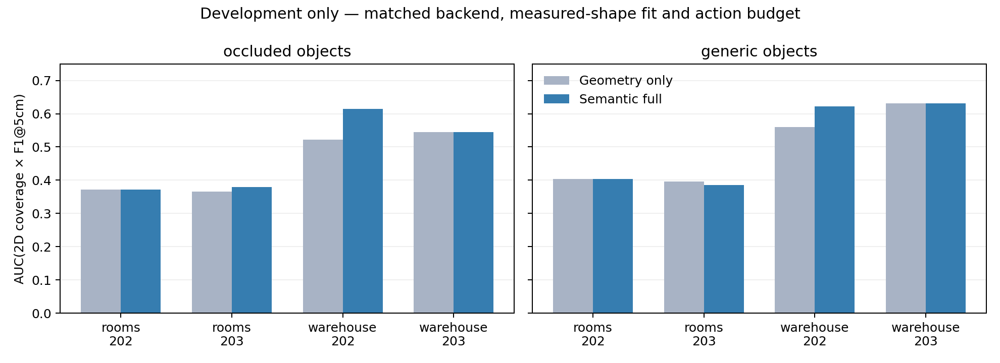

# 本轮联合规划与语义开发全记录

这里只汇总开发实验。重复使用种子和场景不能增加独立样本数，表中相对变化不能作为显著性证明。保留所有完整运行，包含退化版本。

|开发运行|回合数|几何种子|完整方法联合 AUC|去语义联合 AUC|语义相对增量|
|---|---:|---|---:|---:|---:|
|[joint_v2_balance_development_20260910](../joint_v2_balance_development_20260910/results.md)|8|[202, 203]|0.49542|0.49544|-0.004%|
|[joint_v2_camera_development_20260910](../joint_v2_camera_development_20260910/results.md)|12|[202, 203]|0.50937|0.50932|+0.010%|
|[joint_v2_development_20260910](../joint_v2_development_20260910/results.md)|24|[202, 203]|0.49097|0.48782|+0.644%|
|[joint_v2_gated_development_20260910](../joint_v2_gated_development_20260910/results.md)|12|[202, 203]|0.49404|0.49380|+0.048%|
|[joint_v2_smoke_20260910](../joint_v2_smoke_20260910/results.md)|6|[201]|0.43072|0.43078|-0.014%|
|[joint_v3_channels_generic_development_20260910](../joint_v3_channels_generic_development_20260910/results.md)|8|[202, 203]|0.51069|0.49828|+2.491%|
|[joint_v3_channels_occluded_development_20260910](../joint_v3_channels_occluded_development_20260910/results.md)|8|[202, 203]|0.47745|0.45104|+5.857%|
|[joint_v3_fit_development_20260910](../joint_v3_fit_development_20260910/results.md)|6|[202]|0.50528|0.51106|-1.131%|
|[joint_v3_occluded_development_20260910](../joint_v3_occluded_development_20260910/results.md)|6|[202]|0.48723|0.48267|+0.945%|
|[joint_v3_posterior_development_20260910](../joint_v3_posterior_development_20260910/results.md)|40|[202, 203]|0.49407|0.47466|+4.090%|
|[joint_v3_replication_development_20260910](../joint_v3_replication_development_20260910/results.md)|12|[203]|0.48177|0.48196|-0.039%|
|[joint_v3_self_visibility_development_20260910](../joint_v3_self_visibility_development_20260910/results.md)|6|[202]|0.50941|0.49711|+2.473%|

## 最新版本逐场景结果

|场景条件|布局／种子|完整联合 AUC|去语义联合 AUC|Δ联合 AUC|Δ最终覆盖/百分点|
|---|---|---:|---:|---:|---:|
|occluded|rooms／202|0.37158|0.37157|+0.00000|+0.00|
|occluded|rooms／203|0.37920|0.36497|+0.01423|+2.21|
|occluded|warehouse／202|0.61402|0.52245|+0.09157|+0.71|
|occluded|warehouse／203|0.54501|0.54515|-0.00014|+0.00|
|generic|rooms／202|0.40421|0.40421|+0.00000|+0.00|
|generic|rooms／203|0.38541|0.39676|-0.01136|-4.16|
|generic|warehouse／202|0.62158|0.56056|+0.06101|+1.19|
|generic|warehouse／203|0.63158|0.63158|+0.00000|+0.00|

## 完整方案与同后端对照

|对照|完整方法联合 AUC 相对变化|最终覆盖差异/百分点|最终 F1 差异/百分点|
|---|---:|---:|---:|
|coverage|+3.841%|-3.633|-0.732|
|legacy_geometry|+5.688%|-2.101|-1.413|
|geometry_v2|+4.090%|-0.006|+1.997|
|no_hypotheses_v3|-1.723%|-0.677|-0.703|

## 布局分组（开发结果）

|布局|完整方法 − 纯覆盖：联合 AUC 相对变化|最终覆盖差异/百分点|完整方法 − 去物体假设：联合 AUC 相对变化|
|---|---:|---:|---:|
|rooms|-2.811%|-8.238|-1.435%|
|warehouse|+8.587%|+0.972|-1.905%|

## 标签干预（相同最新实现）

|物体条件|标签|平均联合 AUC|平均最终覆盖|
|---|---|---:|---:|
|开放|aligned|0.51069|0.93204|
|开放|shuffled|0.49540|0.92907|
|开放|absent|0.49828|0.93947|
|带背板|aligned|0.47745|0.90332|
|带背板|shuffled|0.45646|0.90129|
|带背板|absent|0.45104|0.89603|

## 细类别信息与二值前景语义的区分

完整方法相对仅物体／背景语义对照：Δ联合 AUC = +0.019055，相对变化 +4.011%。两者共享实测几何似然与物体候选。二值对照关闭类别形状先验和类别近看奖励，保留物体／背景区分。

缺失标签与去语义方法的全部 8 组轨迹、二维已知掩码和最终网格完全一致；16 组标签干预的场景真值与初始非语义观测一致。见标签干预目录的 label_intervention_audit.json。

源码、配置、逐帧深度、雷达、候选评分和最后网格分别保存在各实验目录。独立确认种子 301—308 尚未使用。当前开发结果不能声明完整语义方案已通过；语义增量仍是必须通过的核心判据。
